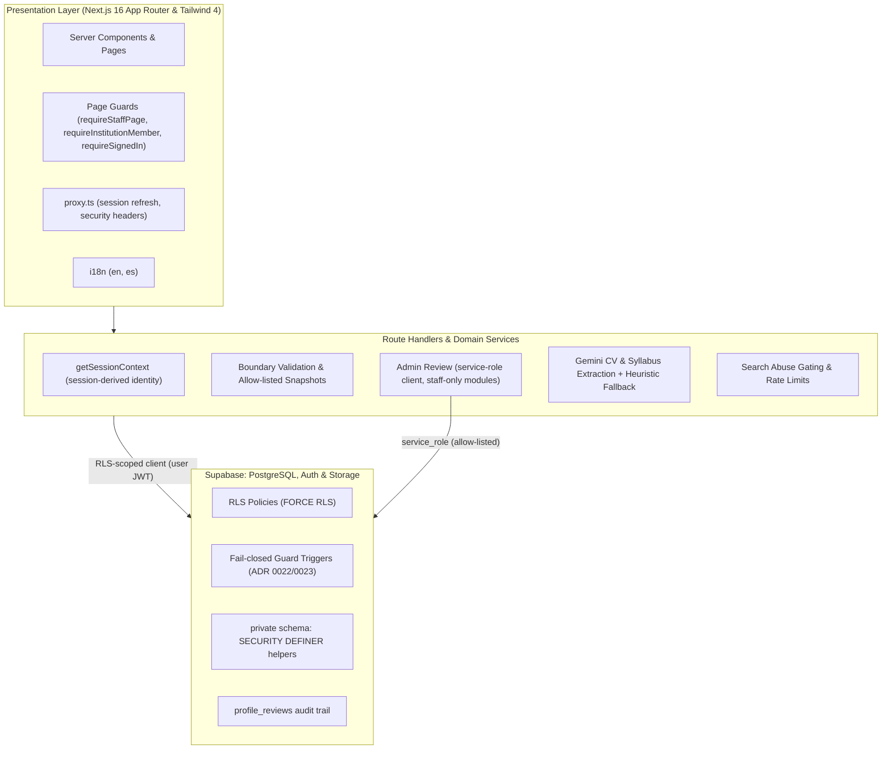
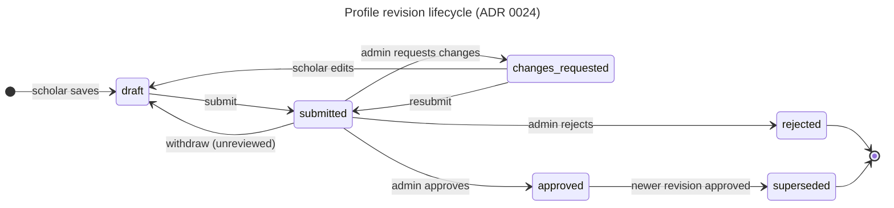
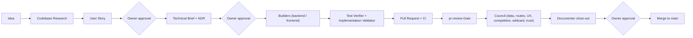

<div align="center">


# FaithFull Scholars
### A Trusted Professional Network for Theological & Biblical Higher Education
**Built for Seminaries, Bible Colleges, Christian Universities, Churches & Ministry Programs**

[](./LICENSE)
[](./CHANGELOG.md)
[](https://nextjs.org)
[](https://supabase.com)
[](https://www.typescriptlang.org)
[](https://tailwindcss.com)
[](https://github.com/ricardojjulia/FaithFullScholars/actions/workflows/ci.yml)
[](https://github.com/ricardojjulia/FaithFullScholars/actions/workflows/e2e.yml)
[](./docs/adr/0022-session-derived-identity-and-rls-helper-isolation.md)

[Quick Start](#-quick-start) · [HOWTO](./HOWTO.md) · [Contributing](./CONTRIBUTING.md) · [Security](./SECURITY.md) · [Support](./SUPPORT.md) · [Versioning](./VERSIONING.md) · [Docs Hub](./docs/README.md) · [Changelog](./CHANGELOG.md)

</div>

---

## 💡 Why This Exists

Theological institutions hire under constraints no general job board understands. A seminary filling an adjunct New Testament post needs more than a CV: it needs **terminal-degree evidence for ATS/ABHE accreditation**, **confessional fit** with its doctrinal standard, **teaching samples**, and **availability** for an online module or a January intensive.

Scholars, meanwhile, have no single trusted place to present their **credentials, publications, syllabi, lectures and doctrinal statement**, under their own control.

**FaithFull Scholars** is the network that connects them:
- **Scholar profiles** with academic identity, disciplines, traditions, affirmed confessional standards and a personal doctrinal statement.
- **Admin-reviewed publication.** Nothing goes public until an editor approves it, and edits to a live profile are staged as revisions.
- **Institutional discovery** by discipline, tradition, availability, language and delivery format, with shortlists, inquiries, postings and printable search-committee dossiers.
- **Course & speaking showcases:** syllabi, sample lectures, course licensing and a conference speaking bureau.
- **Data isolation as a database guarantee:** PostgreSQL Row Level Security, verified by tests that sign in as real roles.

---

## 🚦 Project Status

> **Pilot stage. Not launch-ready.** Phases 0–18 are built and the automated gates pass, but "built" is not "working end to end".
>
> The authorization review in [Council Review 12](./docs/reviews/2026-10-05-council-review-12-synthesis.md) found and fixed defects ([ADR 0022](./docs/adr/0022-session-derived-identity-and-rls-helper-isolation.md), [ADR 0023](./docs/adr/0023-trust-guards-phase2-and-policy-matrix.md)). These are still outstanding:
> - deploying the review-gated profile content migration ([ADR 0025](./docs/adr/0025-review-gated-profile-content.md)), which closes direct edits to live profile content and publishes credentials, publications and confessions on approval; the code is built, the ADR 0025 preflight and migration are still to run;
> - scholar express-interest;
> - institution invitations;
> - live data in several portal screens;
> - a persistent rate limiter;
> - GDPR and field-level encryption.
>
> The full per-feature history, including the known-broken and demo-only list, is in the **[Feature Catalog](./docs/feature-catalog.md)**.

---

## 👥 Who It Serves

| Persona | What they do | Key surfaces |
| :--- | :--- | :--- |
| **🎓 Scholar** | Builds a profile, stages revisions for review, showcases courses and lectures, manages availability, inquiries, contracts and licensing | `/dashboard`, `/dashboard/profile`, `/dashboard/onboarding`, `/dashboard/courses`, `/dashboard/availability` |
| **🏛️ Institution** | Searches and shortlists faculty, sends inquiries, posts openings, triages applicants, exports accreditation matrices and dossiers | `/institution`, `/institution/saved`, `/institution/postings`, `/institution/saved/accreditation` |
| **🛡️ Admin / Editor** | Reviews submitted revisions with a visual diff, verifies institutions, moderates reports, triages pilot feedback | `/admin/reviews`, `/admin/institutions`, `/admin/reports`, `/admin/triage` |
| **🌐 Public visitor** | Browses approved scholars, courses, speakers, opportunities and topic hubs (rate-limited, with an anonymous page cap) | `/scholars`, `/courses`, `/speakers`, `/opportunities`, `/disciplines`, `/traditions` |

---

## 🗺️ Product Surface

```mermaid
graph LR
    subgraph Public ["Public Discovery"]
        P1["Scholar Directory & Profiles"]
        P2["Course Catalog & Syllabi"]
        P3["Speaking Bureau"]
        P4["Academic Opportunities"]
        P5["Discipline & Tradition Hubs (SEO)"]
    end

    subgraph Scholar ["Scholar Workspace"]
        S1["Profile & Doctrinal Revision Editor"]
        S2["Assisted CV Onboarding"]
        S3["Courses, Media & Availability"]
        S4["Inquiries, Contracts & Licensing"]
        S5["Profile Analytics"]
    end

    subgraph Institution ["Institution Portal"]
        I1["Shortlists & Search Dossier"]
        I2["ATS/ABHE Credentials Matrix"]
        I3["Postings & Applicant Matrix"]
        I4["Endorsements & Consortia"]
        I5["Subscriptions & Engagement Contracts"]
    end

    subgraph Admin ["Trust & Governance"]
        A1["Revision Review & Visual Diff"]
        A2["Institution Verification"]
        A3["Content Reports"]
        A4["Pilot Feedback Triage"]
    end

    Scholar -- "submits revisions" --> Admin
    Admin -- "publishes approved snapshots" --> Public
    Institution -- "discovers & contacts" --> Public
    Institution -- "inquiries & contracts" --> Scholar
```



---

## 🏗️ Architecture & Topology

PostgreSQL **Row Level Security is the security boundary**, not application code. Identity always comes from the session and never from a client-supplied id. Trust columns (roles, publication and verification status) are guarded by fail-closed triggers.



More diagrams (request lifecycle, data model, revision lifecycle, directory layout) are in **[docs/architecture.md](./docs/architecture.md)**.

---

## 🔒 Trust & Moderation Model

Guard triggers stop scholars and institutions from publishing, verifying or promoting themselves ([ADR 0022](./docs/adr/0022-session-derived-identity-and-rls-helper-isolation.md), [ADR 0023](./docs/adr/0023-trust-guards-phase2-and-policy-matrix.md)). Profile edits follow the persisted draft-and-review lifecycle below ([ADR 0024](./docs/adr/0024-scholar-revision-lifecycle-and-atomic-review.md)):



Guarantees:
- **Database-enforced transitions.** A scholar can never set `approved`, `rejected` or `superseded`, and cannot edit a submitted revision.
- **Atomic approval.** One service-role-only database function publishes the revision, supersedes the previous one, and writes the audit row in the same transaction.
- **Private revisions.** Only the owning scholar and admins can read revisions.
- **Moderation wins.** Approving a hidden scholar's revision keeps the profile hidden.

---

## 🚀 Quick Start

### Prerequisites
- **Node.js 24.x** (pinned in `package.json` `engines`)
- **Docker** and the **Supabase CLI**, for the local database
- **npm**

### 1. Clone & Install
```bash
git clone https://github.com/ricardojjulia/FaithFullScholars.git
cd FaithFullScholars
npm install
```

### 2. Configure Environment
```bash
cp .env.example .env.local
supabase start            # local Postgres, Auth and Storage; prints the keys for .env.local
npm run seed:pilot        # the 5-scholar pilot cohort (needed for the E2E personas)
```

### 3. Launch Development Server
```bash
npm run dev
```
Open **[http://localhost:3845](http://localhost:3845)** to browse the scholar directory.

See the **[HOWTO](./HOWTO.md)** for environment variables, test personas and troubleshooting.

---

## 🧪 Quality Gates

Every pull request runs these gates in GitHub Actions. The `main` ruleset requires **lint, typecheck, unit-tests** (which includes integration) and **build** to pass. The test-surface gate and E2E also run on every PR, but are not required checks.

```bash
npm run verify           # version check, lint, test-surface, typecheck, tests, RLS and security audits, build
npm run test:e2e         # Playwright, signing in through the real /login flow
npm run test:surface     # every page, route and server action must ship with a test
```

| Gate | Layer | What it proves | Required on `main` |
| :--- | :--- | :--- | :---: |
| **Lint & Typecheck** | Code | ESLint, including a wall against importing the service-role client outside a reviewed allow-list, plus `tsc` | ✅ |
| **Unit & Integration** | Domain + DB | Vitest. Integration suites run against a live local Supabase **as real signed-in roles** | ✅ (`unit-tests`) |
| **Policy Matrix** | Data isolation | Every writable column per role is declared. An undeclared write, or a probe that silently does nothing, fails | ✅ (`unit-tests`) |
| **RLS & Security Audit** | Database | `audit:rls` (FORCE RLS and policy presence) and `audit:security` (Splinter advisor) | ✅ (`unit-tests` job) |
| **Build** | Release | Next.js production build | ✅ |
| **Test Surface** | Coverage | Each discoverable surface has a `covers()`-tagged test or a dated exemption of at most 60 days | runs on every PR |
| **E2E** | Browser | Admin, scholar and institution personas exercise role boundaries and full journeys | runs on every PR |

> A gate is trusted only after it has been shown to **fail on a genuinely bad state**, for example by removing a guard trigger and watching the database tests fail. See [`AGENTS.md`](./AGENTS.md).

---

## 🏭 Software Factory & Council Governance



Non-trivial changes go through the **Council** of read-only audit agents and a **Documenter** that keeps the plan, ADRs and changelog truthful. The workflow lives in [`AGENTS.md`](./AGENTS.md), [`improve-software.md`](./improve-software.md) and [`docs/factory/`](./docs/factory/).

---

## 📚 Documentation & Governance

- 📘 **[HOWTO Operational Guide](./HOWTO.md)**: local setup, environment, personas and test commands.
- 📐 **[System Architecture](./docs/architecture.md)**: topology, request lifecycle, data model and trust boundaries.
- 🗂️ **[Feature Catalog](./docs/feature-catalog.md)**: what each phase built, with the known-broken list.
- 📜 **[Architectural Decision Records](./docs/adr/)**: ADR 0001 onward.
- 🧭 **[Documentation Hub](./docs/README.md)**: index of plans, specs, runbooks, reviews and factory docs.
- 🗺️ **[Master Plan](./docs/FAITHFULL_SCHOLARS_FULL_PLAN.md)** and **[Roadmap](./docs/product/roadmap.md)**: architecture and phase status.
- 🛡️ **[Security Policy](./SECURITY.md)**: vulnerability reporting and data-isolation invariants.
- 🤝 **[Contributing Guidelines](./CONTRIBUTING.md)**: branching, migrations and the PR workflow.
- 🏷️ **[Versioning Policy](./VERSIONING.md)**: pre-GA SemVer lifecycle.
- 📋 **[Changelog](./CHANGELOG.md)**: release history.
- 🏛️ **[Council Governance Protocol](./AGENTS.md)**: quality gates and review mandates.

---

## ⚖️ License

This project is licensed under the **GNU Affero General Public License v3.0 (AGPL-3.0)**. See [`LICENSE`](./LICENSE).
Copyright © 2026 FaithFull Scholars.
