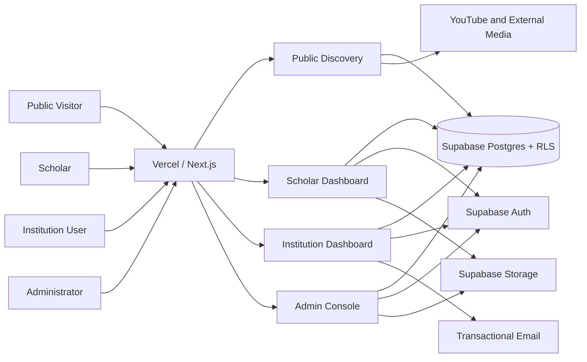

# FaithFull Scholars Full Plan

> **Status:** Approved product, architecture, software-factory, and MVP execution baseline  
> **Consolidated:** June 12, 2026  
> **Primary audience:** Product owners, architects, developers, and AI implementation agents  
> **Required platform:** Next.js on Vercel with a Supabase backend

---

## 1. Executive Summary

FaithFull Scholars is a professional discovery and academic showcase network for professors serving theological colleges, seminaries, Bible colleges, Christian universities, ministry institutes, churches, and related organizations.

The platform embodies the **modern look, feel, and user experience of contemporary LinkedIn**, adapted specifically for the rigor, dignity, and confessional integrity of theological academia (ADR 0007). Profiles emphasize academic credentials, theological and biblical disciplines, institutional affiliations, curriculum vitae, publications, courses, sample teaching content, languages, delivery formats, confessional standards affirmations (ADR 0001), and verified availability for institutional opportunities.

At the core of the platform is an uncompromising **Data Protection, RLS & Anti-Scraping Gating Architecture** (ADR 0008): personal user PII (emails, phone numbers) is strictly isolated from public search surfaces, all 24 database tables enforce 100% Row Level Security, private assets require cryptographically signed URLs, and the public search bar is defended by distributed token-bucket rate limiting, input sanitization, and deep-pagination walls to prevent predatory scraping or candidate harvesting.

The first product is a **Scholar Profile Network** with public course and content discovery. It is not initially a full hiring marketplace.

The platform should answer:

- Who is qualified to teach a particular theological or biblical subject?
- Which scholars are available for adjunct teaching, online instruction, intensives, guest lectures, curriculum review, doctoral supervision, or conference speaking?
- What courses has the scholar taught or prepared?
- Can an institution inspect a syllabus, lecture, free course preview, reading list, or YouTube playlist before contacting the scholar?
- What theological tradition, denomination, languages, credentials, and institutional experience does the scholar publicly identify?
- How can a qualified institution send a respectful, structured inquiry?

## 2. Product Thesis

Discovery of theological faculty is fragmented across institutional websites, CV PDFs, conference programs, denominational networks, personal referrals, YouTube channels, and individual websites.

FaithFull Scholars creates a trusted, searchable academic directory where:

- Scholars maintain one current professional profile.
- Institutions search structured academic and availability data.
- Courses and teaching content are attached to the scholar who offers them.
- Public visitors discover trustworthy theological learning content.
- Admin review protects the credibility of public listings.
- User data is secured by full PostgreSQL RLS, storage encryption, and search abuse gating.

## 3. Platform Baseline

- **Application:** Next.js App Router with TypeScript (Turbopack).
- **Design System:** LinkedIn-Grade Academic Network Design System (ADR 0007) with 3-column desktop layout, persistent universal app bar, and card-based profile architecture.
- **Hosting:** Vercel.
- **Authentication:** Supabase Auth with cookie-based SSR sessions.
- **Database:** Supabase Postgres with 100% Row Level Security (RLS) enforcement.
- **Security & Data Protection:** Multi-tenant isolation (Scholars, Institutions, Admins, Public), PII segregation, token-bucket search rate limiting, deep-pagination walls, and signed storage URLs (ADR 0008).
- **File storage:** Supabase Storage with private encrypted buckets for CVs, full syllabi, and administrative review assets.
- **External media:** YouTube and other external platforms for video, podcasts, and public course content.
- **Styling & Iconography:** Tailwind CSS with accessible semantic tokens, modern Aptos / clean sans geometric typography, and edge-grade Lucide vector iconography.
- **Testing & Quality Gates:** Vitest, PostgreSQL RLS audit (`npm run audit:rls`), ESLint, TypeScript check, and Next.js Turbopack production builds.
- **Deployment:** Vercel preview deployments for pull requests and production deployment from `main`.

## 4. Product Boundaries

The MVP is:

- A scholar profile network.
- A searchable course showcase.
- A structured availability directory.
- A public learning-content discovery portal.
- A lightweight institution-to-scholar inquiry system.
- An admin-reviewed directory.

The MVP is not:

- A learning management system.
- A general social network or feed.
- A payment processor.
- A contract-generation system.
- A complete HR or applicant-tracking system.
- A synchronous chat platform.
- A video-hosting service.
- An automatic credential-verification service.
- A system that infers theological beliefs or denominational identity.

## 5. Users

### Scholars

Professors, adjunct faculty, independent scholars, retired professors, visiting lecturers, doctoral supervisors, curriculum consultants, and ministry educators.

Goals:

- Maintain a credible public academic profile.
- Publish CV highlights and an optional downloadable CV.
- Showcase publications, courses, lectures, and sample content.
- Signal availability.
- Receive qualified institutional inquiries.

### Institutions

Seminaries, Bible colleges, theological colleges, Christian universities, training institutes, churches, denominational offices, and mission organizations.

Goals:

- Search by discipline, course need, credential, language, tradition, region, and availability.
- Review qualifications and teaching samples.
- Save scholars and courses.
- Send structured opportunity inquiries.

### Public Visitors

Students, pastors, church leaders, researchers, and lifelong learners.

Goals:

- Discover scholars.
- Find free lectures, course previews, syllabi, and reading lists.
- Browse theological and biblical topics.

### Administrators

Goals:

- Review scholars and institutions.
- Approve, request changes, reject, or hide profiles.
- Manage verification separately from publication.
- Manage taxonomies and reported content.
- Preserve audit history.

## 6. MVP Features

### Scholar Identity

- Name and preferred title.
- Profile photo.
- Current institution and role.
- Biography.
- Location and time zone.
- Languages.
- Academic and professional links.
- Contact preference.
- Voluntarily disclosed denomination, confession, or tradition.
- Affirmed confessional standards (e.g. Westminster Standards, 1689 London Baptist, Nicene Creed, Lausanne Covenant, Chicago Inerrancy).
- Personal doctrinal statement (text summary or uploaded PDF link).

### Academic Portfolio

- Degrees and awarding institutions.
- Assisted CV ingestion: automated PDF text extraction populating editable draft profile fields to eliminate onboarding friction.
- Structured CV highlights.
- Optional downloadable CV.
- Publications.
- Books, chapters, articles, and conference papers.
- Research interests.
- Supervision areas.
- Grants, fellowships, and awards.

### Course Showcase

- Title and slug.
- Description.
- Discipline and academic level.
- Target audience.
- Delivery modes.
- Availability modes.
- Sample syllabus.
- Reading list.
- Free preview content.
- YouTube video or playlist.
- External course link.
- Availability to teach, adapt, license, or guest lecture.

### Availability

Statuses:

- Open.
- Limited.
- By request.
- Unavailable.

Opportunity types:

- Adjunct course.
- Guest lecture.
- Intensive.
- Online module.
- Course licensing.
- Curriculum review.
- Doctoral supervision.
- Thesis advising.
- Conference speaking.
- Church or ministry training.

Details:

- Earliest term.
- Delivery modes.
- Travel willingness.
- Time zone.
- Languages.
- Institution types served.
- Notes.

### Discovery

Filters:

- Discipline.
- Biblical book.
- Theological topic.
- Course type.
- Availability.
- Delivery format.
- Language.
- Institution.
- Tradition or denomination.
- Confessional standards affirmed.
- Doctrinal statement presence.
- Region.
- Credential level.
- Free content.

Ranking:

1. Exact subject or course match.
2. Confessional / tradition match.
3. Availability match.
4. Language and delivery match.
5. Profile completeness.
6. Free content availability.
7. Recently updated profile.

### Institution Tools

- Institution profile and approval.
- Saved scholars and courses.
- Shortlists.
- Structured inquiry.
- Inquiry history.

Inquiry fields:

- Scholar.
- Optional course.
- Opportunity type.
- Proposed term.
- Delivery mode.
- Contact information.
- Message.

### Admin Tools

- Scholar review queue.
- Revision diff review: side-by-side visual diff of submitted revisions against published snapshots.
- Institution review.
- Approve, request changes, reject, or hide.
- Verification state.
- Review notes and history.
- Taxonomy management (disciplines, traditions, confessional standards).
- Reported-content queue.

## 7. Trust Model

Publication status:

- Draft.
- Submitted.
- Changes requested.
- Approved.
- Hidden.
- Rejected.

Revision Staging Model (ADR 0005):

- Edits to an approved profile do not unpublish the active listing or interrupt public discovery.
- Modifications are saved to a versioned draft revision that is submitted for admin review.
- Admins review changes as structured diffs; approval promotes the revision to the published snapshot.

Implemented lifecycle (ADR 0024, PR #56; migration `20261006090000` not yet applied to production):

- Revisions are persisted in `scholar_profile_revisions`; `sessionStorage` drafts and the hard-coded demo scholar are removed. The editor, onboarding, and preview load and save the real revision.
- Statuses: `draft`, `submitted`, `changes_requested`, `approved`, `superseded`, `rejected`. One open revision (draft, submitted, changes_requested) per scholar, enforced by a partial unique index. A database guard trigger allows only draft, submit, withdraw (while unreviewed), and changes-requested edit or resubmit; the database assigns `revision_number`.
- Endpoints: `GET/PUT /api/scholars/revisions`, `POST /api/scholars/revisions/submit`, `POST /api/scholars/revisions/withdraw` (session identity, RLS-scoped client, `revisionId` pin returns 409 on a stale tab, 256 KB cap returns 413). Admin decisions go through `POST /api/admin/reviews/[id]` and the service-role-only `review_profile_revision()` RPC (atomic decision plus `profile_reviews` audit row). Feedback notes are required for request-changes and reject and capped at 2000 characters (reversible default chosen during review; owner-visible decision).
- Revisions are readable only by the owning scholar and admins.
- Approval copies scalar fields only. Disciplines, traditions, confessions, credentials, and publications are not promoted to relational tables, so public pages and match-faculty do not yet reflect approved revisions.

Known gaps (accepted residual risk, see ADR 0024):

- HIGH, pre-existing: a scholar can still UPDATE live `scholars` content columns and child tables (`scholar_disciplines`, `scholar_confessions`, `scholar_traditions`, credentials, publications) directly under RLS, bypassing review. Next slice: lock content columns to the review path, paired with relational promotion on approval.
- Rejected and superseded snapshots (possible religious-belief data, GDPR Art. 9) are retained indefinitely and admin-readable; belongs to the GDPR retention/erasure slice.

Verification status:

- Self-reported.
- Institution-affiliated.
- Verified.

Rules:

- Approval allows publication; it does not automatically verify every claim.
- Theological tradition is self-disclosed unless explicitly verified.
- AI-assisted imports remain drafts until the scholar approves them.
- Draft, submitted, rejected, changes-requested, and hidden profiles are never public.

## 8. Information Architecture

```text
/
/scholars
/scholars/:slug
/courses
/courses/:slug
/topics/:slug
/institutions/:slug

/dashboard
/dashboard/profile
/dashboard/cv
/dashboard/publications
/dashboard/courses
/dashboard/availability
/dashboard/inquiries

/institution
/institution/saved
/institution/inquiries

/admin
/admin/reviews
/admin/institutions
/admin/taxonomy
/admin/reports
```

## 9. Architecture



### Vercel

- Hosts Next.js.
- Runs server-rendered pages, route handlers, and server actions.
- Creates preview deployments for pull requests.
- Deploys production from `main`.
- Stores environment-specific configuration.

Controls:

- Preview and production must use the intended Supabase environment.
- Server secrets never use `NEXT_PUBLIC_`.
- Preview workflows are verified before production.

### Supabase

- Authenticates users.
- Stores relational data.
- Enforces RLS.
- Stores CVs, profile images, and course documents.
- Maintains SQL migrations and seed data.

Controls:

- Enable RLS on every exposed table.
- Store roles in app-controlled data, not user-editable metadata.
- Keep the service-role key server-only.
- Store sensitive files private by default.
- Test direct Data API access.

## 10. Domain Model

Core tables:

- `accounts`
- `scholars`
- `scholar_profile_revisions`
- `institutions`
- `institution_users`
- `disciplines`
- `scholar_disciplines`
- `traditions`
- `scholar_traditions`
- `confessional_standards`
- `scholar_confessions`
- `credentials`
- `publications`
- `courses`
- `course_disciplines`
- `media_links`
- `availability_profiles`
- `inquiries`
- `saved_scholars`
- `saved_courses`
- `profile_reviews`
- `reports`

Key scholar fields:

- `account_id`
- `slug`
- `full_name`
- `title`
- `profile_photo_path`
- `current_institution`
- `current_role`
- `biography`
- `location`
- `timezone`
- `contact_preference`
- `doctrinal_statement_text`
- `doctrinal_statement_path`
- `published_revision_id`
- `draft_revision_id`
- `profile_status`
- `verification_status`

Key revision fields:

- `scholar_id`
- `revision_number`
- `status` (draft, submitted, changes_requested, approved, superseded)
- `snapshot_data` (JSONB of versioned fields)
- `admin_notes`
- `submitted_at`
- `reviewed_at`

Key course fields:

- `scholar_id`
- `title`
- `slug`
- `description`
- `level`
- `discipline_id`
- `delivery_modes`
- `availability_modes`
- `syllabus_path`
- `reading_list`
- `public_preview_enabled`
- `visibility`

Key inquiry fields:

- `institution_id`
- `scholar_id`
- `course_id`
- `opportunity_type`
- `proposed_term`
- `delivery_mode`
- `message`
- `contact_email`
- `status`

## 11. Authorization and RLS

### Public

May read:

- Approved public scholars.
- Approved public courses.
- Public media and taxonomy.

May not read:

- Drafts.
- Admin notes.
- Private contact data.
- Private CVs.
- Institution inquiries.

### Scholar

May:

- Manage their own profile, credentials, publications, courses, media, files, and availability.
- Submit their own profile.
- Read inquiries addressed to them.

May not:

- Edit another scholar.
- Approve themselves.
- Change verification status.
- Read private admin notes.

### Institution User

May:

- Manage approved institution records according to role.
- Save scholars and courses.
- Send inquiries.
- Read their institution's inquiries.

May not:

- Access another institution's private data.
- Bypass scholar visibility.
- Use bulk outreach unless separately approved.

### Admin

May:

- Review scholars and institutions.
- Change publication and verification status.
- Manage reports and taxonomy.
- Read files required for review.

Admin actions must be auditable.

## 12. Storage

Buckets:

- `profile-assets`
- `cv-files`
- `course-documents`

Rules:

- Profile images are public only for approved profiles.
- CVs are private by default.
- Scholars manage their own files.
- Admins can read files required for review.
- Public files require explicit publication and an approved parent record.
- Video is not stored in Supabase Storage for the MVP.

## 13. External Media

Supported:

- YouTube.
- Vimeo when needed.
- Personal and institutional websites.
- Podcasts.
- External course pages.

Controls:

- Require `https`.
- Validate provider URLs.
- Normalize metadata.
- Use privacy-conscious embeds.
- Clearly attribute external ownership.

## 14. Abuse and Moderation

- Validate links.
- Rate-limit inquiries and reports.
- Require approved institutions for formal inquiries.
- Preserve review history.
- Soft-delete moderation-sensitive records first.
- Provide report-profile and report-content actions.
- Allow scholars to hide profiles.
- Separate public and private contact fields.

## 15. Software Factory

Required flow:

```text
Idea
  -> product definition
  -> feature design
  -> architecture review
  -> ADR
  -> execution plan
  -> implementation
  -> tests and review
  -> deployment
  -> roadmap and documentation closeout
```

Definition of ready:

- One clear user outcome.
- Explicit non-goals.
- Data changes identified.
- Permission boundaries documented.
- Tests described.
- Dependencies named.
- Exact files and commands listed.

Definition of done:

- Code implemented.
- Tests pass.
- Lint and type checks pass.
- RLS and storage policies verified.
- Visibility rules verified.
- Vercel preview smoke tests pass.
- Documentation updated.
- Limitations recorded.
- Next slice identified.

AI agents must not:

- Infer credentials, tradition, denomination, or availability.
- Publish AI claims without scholar approval.
- Expose service-role keys.
- Use user-editable metadata for authorization.
- Expose draft or hidden records.
- add payments, contracts, chat, LMS, or feed features without approval.

## 16. Target Repository Layout

```text
app/
  (public)/
  dashboard/
  institution/
  admin/
components/
  admin/
  courses/
  forms/
  profiles/
  search/
lib/
  auth/
  courses/
  db/
  inquiries/
  media/
  notifications/
  profiles/
  review/
  search/
  supabase/
  taxonomy/
supabase/
  config.toml
  migrations/
  seed.sql
tests/
  unit/
  integration/
  e2e/
```

## 17. Environment Contract

```bash
NEXT_PUBLIC_SUPABASE_URL=
NEXT_PUBLIC_SUPABASE_PUBLISHABLE_KEY=
SUPABASE_SERVICE_ROLE_KEY=
SUPABASE_PROJECT_ID=
```

Rules:

- Do not commit `.env.local`.
- Do not commit `.vercel/`.
- Service-role credentials are server-only.
- Preview and production should use separate Supabase environments where possible.

## 18. Execution Plan

### Phase 0: Application Foundation

> **Status:** Completed (Next.js 16 App Router, Tailwind CSS, Supabase SSR helpers, Vitest, and CI pipeline)

1. Initialize Next.js App Router with TypeScript, Tailwind, ESLint, and Vercel configuration.
2. Add Vitest/Jest, Testing Library, Playwright, and `npm run verify`.
3. Install `@supabase/supabase-js` and `@supabase/ssr`.
4. Add browser, server, and middleware Supabase clients.
5. Verify cookie-backed sessions using current Supabase SSR guidance.

Acceptance:

- `npm run lint` passes.
- `npm run test` passes.
- `npm run build` passes.

### Phase 1: Supabase Foundation

> **Status:** Completed (22 domain tables, RLS policies on all 24 public tables, ADR 0005 revision model, theological taxonomy and confessional standards seed data, TypeScript domain layer)

1. Run `npx supabase --help`.
2. Run `npx supabase init`.
3. Start local Supabase.
4. Create initial schema migration.
5. Create tables, constraints, indexes, and audit timestamps.
6. Enable RLS on all exposed tables.
7. Add public, scholar, institution, and admin policies.
8. Add storage buckets and policies.
9. Add fictional seed data.
10. Generate TypeScript database types.

Acceptance:

- `npx supabase db reset` succeeds.
- Seed data loads.
- Direct unauthorized access fails.

### Phase 2: Authentication and Roles

> **Status:** Largely implemented, with security corrections (ADR 0022, Council Review 12, 2026-10-05). Signup, login, logout, and recovery exist (`app/(auth)`, `app/auth`, `lib/auth/auth-actions.ts`). Roles are read from `public.accounts` only. Protected pages guard themselves (`lib/auth/guards.ts`) rather than relying on layouts. Institution self-signup creates only new pending institutions. Database-level trust-column guard triggers (fail closed) protect `accounts.role`, scholar and institution approval fields, and inquiry status; only the recipient scholar can reopen an accepted or declined inquiry. CI run `37360500352` (PR #47) verified this with real-role tests. **Still open:** inviting members to an existing institution (no invitation flow exists; signup now says so honestly), role-boundary tests through the real login flow (Playwright), and the same column/state-transition guards for `institution_subscriptions`, `institution_contracts`, `course_licensing_agreements`, `institution_endorsements`, and consortium tables (ADR 0023, follow-up PR).

1. Implement signup, login, logout, and account recovery.
2. Implement scholar, institution-user, and admin roles.
3. Implement protected routes.
4. Keep roles out of user-editable metadata.

Acceptance:

- Server-rendered authenticated routes work.
- Anonymous access to dashboards fails.
- Role boundaries are tested.

### Phase 3: Public Discovery (Roadmap Phase 2 & Milestone 2.5)

> **Status:** Completed (Public scholar directory, multi-criteria filtering by discipline/tradition/confession/availability, canonical scholar profile displaying credentials and doctrinal statements, course showcase catalog, syllabus inspection, strict draft isolation, unit & integration tests).
> **Milestone 2.5 Enhancement Completed:** Modern LinkedIn-grade design system (ADR 0007), universal persistent top bar with shortcut `/` and quick academic queries, 3-column desktop layout (sticky filters, feed, recommendations rail), cover banners, overlapping avatars, token-bucket search rate limiter (`search_rate_limits`), input sanitization, and 3-page anonymous search cap to prevent candidate scraping (ADR 0008). 100% RLS compliance on all 25 public tables.

1. Build scholar directory and filters.
2. Build scholar profile pages.
3. Build course directory and course pages.
4. Add media previews and public topic pages.
5. Implement LinkedIn-grade navigation shell, profile cards, and 3-column discovery feed.
6. Implement search abuse gating, rate-limiting, and deep pagination access wall.

Acceptance:

- Only approved records are public.
- Draft and hidden records return not found.
- Private contact data is not exposed.
- Search rate limits block scraping attempts with HTTP 429.
- Anonymous discovery is capped at 3 pages before prompting sign-in.
- 100% RLS enforced at PostgreSQL layer.

### Phase 4: Scholar Dashboard (Completed)

> **Status:** Partially complete (PR #56, awaiting owner approval and production migration `20261006090000`: scholar drafts now persist as real revisions and can be submitted, withdrawn, and reviewed; `sessionStorage` is removed. Remaining: live-row content columns and child tables are still directly writable by the scholar under RLS (HIGH, next slice), and approval promotes scalar fields only). Built: Assisted CV onboarding with heuristic parsing, revision staging manager UI, doctrinal statement & confessional standards manager, course/syllabus manager, availability calendar, LinkedIn-grade staging preview, universal translation framework with Spanish `es` catalog).

1. Build profile editor.
2. Build CV and publication manager.
3. Build course and media manager.
4. Build availability manager.
5. Build profile preview and submission.

Acceptance:

- [x] Scholars edit only their own records.
- [x] CV privacy works.
- [x] Unsafe media URLs fail.
- [x] RLS mirrors application authorization.

### Phase 5: Admin Trust Workflows (Completed)

> **Status:** Completed (Admin review queue at `/admin/reviews`, side-by-side visual diff inspector comparing published baseline vs submitted revision, approve/request-changes/reject/hide actions with published snapshot promotion, review audit log in `profile_reviews`, institution verification queue at `/admin/institutions`, reported content moderation queue at `/admin/reports`).

1. Build profile review queue.
2. Add approve, request changes, reject, and hide actions.
3. Preserve review history.
4. Build institution approval.
5. Build reported-content workflow.

Acceptance:

- [x] Review is admin-only.
- [x] Approval controls publication and snapshot promotion.
- [x] Verification remains separate.
- [x] 100% RLS compliance on all 25 tables.

### Phase 6: Institution Workflows (Completed)

> **Status:** Completed, with caveats (Council 12: rate limiting is in-memory and per instance; inquiry `contact_email` is client-supplied; `/institution` and `/dashboard` metrics and `/institution/saved` are partly hard-coded fixtures; scholar express-interest is covered under Phase 17). Built: Structured faculty outreach modal on public profiles, candidate shortlists and saved courses in `saved_scholars` / `saved_courses`, scholar inquiry inbox at `/dashboard/inquiries`, institution portal workspace at `/institution`, `/institution/inquiries`, `/institution/saved`, `/institution/profile`, 10 inquiries/hr rate limiting, transactional notification email abstraction, and complete integration test coverage).

1. Build institution profiles and membership.
2. Build saved scholars and courses.
3. Build structured inquiries.
4. Add rate limiting.
5. Add scholar notifications.

Acceptance:

- [x] Only approved institutions send formal inquiries.
- [x] Institutions cannot access each other's records.
- [x] Inquiries are visible only to authorized parties.
- [x] 100% RLS compliance on all 25 tables.

### Phase 7: Vercel Deployment

1. Link the Vercel project.
2. Configure preview and production environment variables.
3. Verify target Supabase project before migrations.
4. Run `vercel build`.
5. Create and test a preview deployment.

Acceptance:

- Preview deployment passes public, scholar, admin, and institution smoke tests.
- Production secrets remain server-only.

### Phase 8: Platform Expansion & Authoritative Institutional Ecosystem (Completed)

> **Status:** Completed (Institutional postings marketplace at `/opportunities`, institutional endorsements at `/institution/endorsements`, SEO topic hubs at `/disciplines` and `/traditions`, modern clean typography & SVG iconography, 100% RLS coverage with 88 policies).

1. [x] Configure strict HTTP security headers: CSP with YouTube/Unsplash/Supabase whitelisting, HSTS, `X-Frame-Options: DENY`, `X-Content-Type-Options: nosniff`, and `Permissions-Policy`.
2. [x] Add comprehensive end-to-end integration tests validating discovery, CV onboarding, revision staging, visual diffs, admin approval, rate limiting, and structured inquiries.
3. [x] Publish the Production Release Readiness Checklist ([`docs/deployment/release-readiness-checklist.md`](deployment/release-readiness-checklist.md)).
4. [x] Create the Pilot Cohort Diagnostic Inspector script (`scripts/verify-pilot-readiness.ts`).
5. [x] Implement institutional opportunities marketplace (`institution_postings`, `/opportunities`, `/institution/postings`).
6. [x] Implement authoritative institutional endorsements (`institution_endorsements`, `/institution/endorsements`).
7. [x] Verify 100% RLS across all 28 tables, Splinter security checks, and secret quarantine.

### Phase 9: Theological Conference Speaker Directory & Institutional Speaking Bureau (Completed)

> **Status:** Completed (Dedicated public speaking bureau directory at `/speakers`, keynote topics data architecture in `public.speaker_topics`, profile dossier speaking portfolio card `<ScholarSpeakerTopicsCard />`, scholar dashboard manager at `/dashboard/availability`, 1-click structured inquiry workflow, 100% RLS coverage with 94 policies, and full verification: 151 vitest tests across 27 suites, 12 Playwright E2E browser tests, 29/29 tables RLS enforced, 16 deployment pre-flight checks).

1. [x] Create `speaker_topics` table with 6 RLS policies, covering indexes, and updated_at trigger (`supabase/migrations/20260921130000_speaking_bureau.sql`).
2. [x] Implement `speaker-service.ts` with target audience filtering (`academic`, `pastoral`, `church_wide`, `undergraduate`).
3. [x] Build public speaking bureau directory (`/speakers`) and speaker card component (`SpeakerCard`).
4. [x] Add speaking bureau card to scholar profile dossier (`/scholars/[slug]`) and integrate with structured inquiry modal.
5. [x] Add speaking topic management UI to scholar dashboard (`/dashboard/availability`).
6. [x] Seed reference speaking topics in `seed.sql` and `scripts/seed-pilot-cohort.ts`.
7. [x] Extend Playwright E2E tests (`tests/e2e/speaker-discovery.spec.ts`) and deployment pre-flight checks (`scripts/verify-deployment.ts`).

### Phase 10: Tiered Institutional Subscriptions & Booking Contracts Workflow (Completed)

> **Status:** Completed (Three-tier institutional membership in `public.institution_subscriptions` with automated quota meters at `/institution/subscription`, formal academic engagement contracts in `public.institution_contracts` and `public.contract_milestones` at `/institution/contracts` & `/dashboard/contracts`, 100% RLS coverage across 32 tables, and full verification: 158 vitest tests across 30 suites, 15 Playwright E2E browser tests, 0 Splinter findings, 16 deployment pre-flight checks).
>
> **Council Review 12 (2026-10-05):** Built, but not authorization-safe. Any institution member could set its own tier and limits (the upgrade route had no payment or owner check). An institution could accept a contract on the scholar's behalf, and a scholar could rewrite contract compensation. Fixed in ADR 0023 (trust guards phase 2); plan changes become staff-managed until billing exists.

1. [x] Create `institution_subscriptions`, `institution_contracts`, and `contract_milestones` tables with 16 RLS policies, covering foreign key indexes (Splinter 0001), and pinned updated_at triggers (`supabase/migrations/20260922000000_institutional_subscriptions_and_contracts.sql`).
2. [x] Implement `subscription-service.ts` for quota consumption, search committee seats, and tier upgrades (Basic, Verified Seminary, Premier Partner).
3. [x] Implement `contract-service.ts` for adjunct/modular/speaking agreement drafting, milestone tracking, and bilateral scholar signing transitions.
4. [x] Build institutional subscription management view (`/institution/subscription`) with quota meters and tier comparisons.
5. [x] Build institutional contract drafting & milestone manager (`/institution/contracts`, `/institution/contracts/[id]`).
6. [x] Build scholar engagement contract review and signing workspace (`/dashboard/contracts`).
7. [x] Extend Playwright E2E test suite (`tests/e2e/subscriptions-and-contracts.spec.ts`) and deployment pre-flight verification (`scripts/verify-deployment.ts`).

### Phase 11: Seminary Consortia & Multi-Campus System Accounts (Completed)

> **Status:** Completed (Collaborative dean workspace at `/institution/consortium`, consortia and multi-campus federation in `public.consortiums` and `public.consortium_members`, 100% RLS coverage with 7 policies, covering indexes, full REST APIs, universal navigation link, and complete verification: unit, integration, and Playwright tests).
>
> **Council Review 12 (2026-10-05):** "100% RLS coverage" meant policies exist, not that they are safe. A pending institution could found a consortium and list any institution as an *active* member without its consent. Fixed in ADR 0023 (approved founders only; invitations start pending).

1. [x] Create `consortiums` and `consortium_members` tables with 7 RLS policies, foreign key covering indexes (Splinter 0001), and pinned updated_at triggers (`supabase/migrations/20260923140000_seminary_consortiums.sql`).
2. [x] Implement `lib/consortium/consortium-service.ts` for atomic consortia creation, member invitations, and cross-campus candidate discovery.
3. [x] Build institutional consortium workspace (`/institution/consortium`) with system leads, sister campuses, and candidate discovery links.
4. [x] Add REST API endpoints (`GET/POST /api/institution/consortium`, `POST/DELETE /api/institution/consortium/members`).
5. [x] Harden institutional AI faculty matcher (`POST /api/ai/match-faculty`) with tier authorization and session validation.
6. [x] Reconcile pilot fixtures across `supabase/seed.sql` and `scripts/seed-pilot-cohort.ts`.
7. [x] Extend Playwright E2E test suite and deployment pre-flight verification.

### Phase 12: Course Licensing, Syllabus Distribution Agreements & ATS/ABHE Accreditation Badges (Completed)

> **Status:** Completed (Institutional licensing portal at `/institution/licensing`, scholar licensing dashboard at `/dashboard/licensing`, syllabus distribution requests in `public.course_licensing_agreements`, ATS/ABHE/TRACS/HLC accreditation badges, 100% RLS coverage across 35 tables, 123 policies, and full verification: 194 vitest tests across 41 suites, 36 Playwright E2E browser tests, 0 Splinter security findings, 21 deployment pre-flight checks).
>
> **Council Review 12 (2026-10-05):** Licensing policies allowed four abuses: forged counterparty signatures, `active` status without both signatures, terms swapped after signing, and licenses for courses the scholar doesn't offer. Fixed in ADR 0023.

1. [x] Create `course_licensing_agreements` table with 6 RLS policies, covering indexes (Splinter 0001), and search-path-pinned updated_at triggers (`supabase/migrations/20260924000000_course_licensing_and_accreditation.sql`).
2. [x] Extend `public.institutions` with `accreditation_body`, `accreditation_status`, and `accreditation_verified_at` attributes.
3. [x] Implement `lib/licensing/licensing-service.ts` with bilateral signing transitions and automatic 85/15 royalty revenue splits.
4. [x] Build institutional licensing portal (`/institution/licensing`) and scholar licensing workspace (`/dashboard/licensing`).
5. [x] Build authoritative `<AccreditationBadge />` component for verified institutional status.
6. [x] Add syllabus distribution agreement modal (`<CourseLicensingModal />`) integrated into course catalog dossier.
7. [x] Add REST API endpoints (`GET/POST /api/institution/licensing`, `GET /api/dashboard/licensing`, `POST /api/dashboard/licensing/[id]/sign`).
8. [x] Extend Playwright E2E test suite (`tests/e2e/course-licensing.spec.ts`) and deployment pre-flight checks.

### Phase 13: Premium Scholar Profiles, Distinguished Faculty Dossiers & Media Showcase (Completed)

> **Status:** Completed (ADR 0014: Distinguished Faculty Fellow tier with tamper-proof anti-privilege escalation trigger `prevent_scholar_tier_escalation`, ORCID / Google Scholar validation, SBL Handbook of Style 2nd ed. / Chicago 17th ed. citation formatting, zero-CLS click-to-play media facade for lectures/podcasts/videos, faculty media manager at `/dashboard/media`, board-ready print-optimized candidate dossier route at `/scholars/[slug]/dossier`, 100% RLS coverage across 35 tables, 223 passing unit/integration tests across 44 suites, 38 Playwright E2E tests, 0 Splinter findings, 21 deployment pre-flight checks, and 14/14 pilot readiness checks).

1. [x] Create migration `supabase/migrations/20260924140000_distinguished_scholar_dossiers.sql`: add `profile_tier`, `orcid_id`, `google_scholar_url` to `public.scholars`; add anti-privilege escalation trigger preventing non-admins from self-elevating to `distinguished_fellow`; extend `public.media_links` with `is_featured`, `thumbnail_url`, `duration_seconds`.
2. [x] Implement domain types, queries, and diff tracking in `lib/domain/types.ts`, `lib/domain/queries.ts`, and `lib/domain/diff.ts` preserving strict search neutrality.
3. [x] Implement `lib/media/showcase-service.ts` with zero-CLS safe iframe embed generation and URL sanitization.
4. [x] Implement `lib/profiles/dossier-service.ts` with SBL 2nd ed. / Chicago 17th ed. citation formatting and terminal degree validation.
5. [x] Create UI components: `<DistinguishedBadge />`, `<ScholarMediaShowcase />`, `<DossierPrintButton />`.
6. [x] Build board-ready print candidate dossier route (`/scholars/[slug]/dossier`) with print-optimized CSS, hiding screen navigation, and page break rules.
7. [x] Build faculty media manager (`/dashboard/media`) and REST APIs (`GET/POST /api/scholars/media`, `PATCH/DELETE /api/scholars/media/[id]`).
8. [x] Extend test suite with unit tests (`tests/unit/media-showcase.test.ts`, `tests/unit/dossier-service.test.ts`), RLS/trigger integration tests (`tests/integration/scholar-media.test.ts`), and Playwright E2E test (`tests/e2e/distinguished-dossier.spec.ts`).
9. [x] Update pilot fixtures and verification diagnostics (14/14 checks PASS in `scripts/verify-pilot-readiness.ts`).

### Phase 14: Wildcard Innovation Trio — Board Executive Dockets, Confessional Lens Matrix & SabbaticalSwap Network (Completed)

> **Status:** Completed (ADR 0015, ADR 0016, ADR 0017: 1-click Board of Trustees Search Committee Docket Generator at `/institution/saved/dossier` with candidate tiering and confidential deliberation notes; Confessional Lens Doctrinal Alignment Matrix comparing candidate confessions against institutional standards at `lib/search/confessional-matcher.ts` and `<ConfessionalAlignmentMatrix />`; SabbaticalSwap Visiting Scholar & Sabbatical Exchange Network under `/opportunities` and `/institution/consortium`; 228 passing unit/integration tests across 45 suites, 38 Playwright E2E tests, 100% RLS across 35 tables, 21 deployment pre-flight checks, and 14/14 pilot readiness checks).

1. [x] Implement Board of Trustees Executive Search Committee Docket Generator (ADR 0015) in `components/institution/board-docket-summary.tsx` and `app/(institution)/institution/saved/dossier/page.tsx`.
2. [x] Implement Confessional Lens Doctrinal Alignment Matrix (ADR 0016) in `lib/search/confessional-matcher.ts`, `components/scholars/confessional-alignment-matrix.tsx`, and scholar profile route.
3. [x] Implement SabbaticalSwap Visiting Scholar & Sabbatical Exchange Network (ADR 0017) in `lib/postings/postings-service.ts`, `app/opportunities/page.tsx`, and `app/(institution)/institution/consortium/page.tsx`.
4. [x] Add unit tests for theological confessional matching (`tests/unit/confessional-matcher.test.ts`).
5. [x] Maintain 100% symmetric i18n support across English and Spanish in `lib/i18n/messages/en.json` and `lib/i18n/messages/es.json`.

### Phase 15: Doctoral Dissertation Supervision & External Committee Reader Exchange (Completed)

> **Status:** Completed (ADR 0018: Structured discovery, credential verification, and 1-click inquiry dispatch for external Th.M., Ph.D., and D.Min. dissertation defense committees compliant with ATS Standards 4 & 5; `<ScholarDoctoralSupervisionCard />` mounted on `/scholars/[slug]`; full English & Spanish localization in `lib/i18n/messages/`; 232 passing unit/integration tests across 46 suites, 38 Playwright E2E tests, 100% RLS across 35 tables, 21 deployment pre-flight checks, and 14/14 pilot readiness checks).

1. [x] Implement `<ScholarDoctoralSupervisionCard />` in `components/scholars/scholar-doctoral-supervision-card.tsx` with ATS Standard 4/5 accreditation badge, verified terminal doctorate credentials, supervisory research fields, defense formats, and 1-click modal trigger.
2. [x] Mount card in `app/scholars/[slug]/page.tsx` for scholars with active `doctoral_supervision` availability.
3. [x] Add bilingual i18n support in `lib/i18n/messages/en.json` and `lib/i18n/messages/es.json` under `doctoral` namespace.
4. [x] Author comprehensive unit test suite in `tests/unit/doctoral-supervision.test.ts`.

### Phase 16: ATS/ABHE Accreditation Self-Study Faculty Credentials Matrix (Completed)

> **Status:** Completed (ADR 0019: Automated ATS Standard 3 / ABHE Standard 9 faculty credential self-study matrix generator, compliance KPI scoring, UTF-8 BOM CSV export for accreditation evaluators at `/institution/saved/accreditation`, print CSS self-study report styling, root branded 404 and global error boundaries; 243 unit tests across 48 suites, 39 Playwright E2E tests, 100% RLS across 35 tables, 22 deployment pre-flight checks).

1. [x] Implement `lib/accreditation/ats-matrix-generator.ts` with terminal degree heuristics, confessional standard checks, and RFC-4180 CSV compilation.
2. [x] Build candidate credentials self-study matrix UI (`components/institution/ats-compliance-matrix-table.tsx`).
3. [x] Mount accreditation view at `/institution/saved/accreditation` with `@media print` support and CSV download.
4. [x] Create error boundaries (`app/not-found.tsx` and `app/error.tsx`).
5. [x] Add unit tests in `tests/unit/ats-matrix-generator.test.ts` and E2E test in `tests/e2e/accreditation-matrix.spec.ts`.

### Phase 17: Confessional Common Application & Search Committee Applicant Matrix (Completed)

> **Status:** Built but not working end to end (Council Review 12 correction: `POST /api/postings/[id]/express-interest` always fails under RLS because scholars cannot insert `inquiries`, so the applicant matrix has no real applicants, and an application model is roadmap work. The "hardened API authorization" in this phase was rebuilt in ADR 0022; the earlier version accepted anonymous institution IDs outside production). Intended scope: 1-click Common Application interest expression linking verified scholar dossiers to faculty search opportunities, search committee candidate matrix at `/institution/postings/[id]/applicants`, candidate triage status workflow, ATS Standard 3 terminal doctorate and confessional fit scoring, RFC-4180 CSV export, candidate dossier modal, shell/API security hardening, bilingual i18n parity; 251 unit/integration tests across 49 suites, 41 Playwright E2E tests, 35/35 tables RLS enforced, 6/6 Splinter checks passing, 22 deployment pre-flight checks).

1. [x] Implement `lib/postings/applicant-service.ts` compiling applicant reports, ATS Standard 3 doctorates, confessional fit, and CSV export.
2. [x] Build search committee candidate matrix UI (`components/institution/posting-applicant-matrix.tsx`) with status filtering, CSV export, and print styles.
3. [x] Mount applicant matrix page at `/institution/postings/[id]/applicants`.
4. [x] Add "Applicant Matrix" navigation link from institutional postings list (`app/(institution)/institution/postings/page.tsx`).
5. [x] Format applicant submission metadata in `app/api/postings/[id]/express-interest/route.ts`.
6. [x] Harden API routes (`/api/institution/saved-scholars`, `/api/institution/saved-courses`, `/api/inquiries/[id]`) with user authentication, institutional tenancy, and sanitized error responses.
7. [x] Implement dynamic scholar dashboard navigation (`components/scholar/scholar-dashboard-nav.tsx`), add print-hiding on institution layout, and improve universal search bar ARIA labeling.
8. [x] Add unit tests (`tests/unit/posting-applicants.test.ts`) and Playwright E2E test (`tests/e2e/applicant-matrix.spec.ts`).
9. [x] Seed candidate reference data in `scripts/seed-pilot-cohort.ts`.
10. [x] Maintain 100% key parity in `lib/i18n/messages/en.json` and `es.json` under `applicant_matrix`.

### Phase 18: Theological Guild Annual Conference (ETS/SBL/EPS) Mobile Interview & Presentation Hub (Completed)

> **Status:** UI built on in-memory demo data only (Council Review 12 correction: `lib/conferences` does not persist bookings or rubric scores; live loaders are roadmap work). Intended scope: ADR 0021: Search committee mobile convention suite at `/institution/conferences` for the November ETS/SBL/EPS annual meetings, candidate floor docket with 30-min interview booking, confidential committee deliberation rubrics scoring scholarship, pedagogy, and confessional alignment, scholar profile presentation badge `<ConferencePresentationBadge />` on `/scholars/[slug]`, accessible interview booking modal `<ConferenceInterviewModal />`, shell print-hiding, PublicNav active link detection, error sanitization, bilingual i18n parity, and comprehensive verification: 261 passing unit/integration tests across 50 suites, 43 Playwright E2E browser tests across 16 spec files, 35/35 tables RLS enforced, 6/6 Splinter security checks).

1. [x] Model annual meetings (ETS 2026, SBL/AAR 2026, EPS 2026), paper presentations, session rooms, and interview appointments in `lib/conferences/conference-types.ts`.
2. [x] Implement `lib/conferences/conference-service.ts` for conference attendees queries, convention interview booking, slot collision defense, and confidential committee deliberation scoring.
3. [x] Build search committee convention suite page (`app/(institution)/institution/conferences/page.tsx`) with conference switcher, candidate briefing, deliberation scoring, and print-optimized docket.
4. [x] Add "Conferences" navigation link to institutional navigation (`components/institution/institution-nav.tsx`).
5. [x] Build `<ConferencePresentationBadge />` and `<ConferenceInterviewModal />` with accessible ARIA semantics (`role="dialog"`, `aria-modal={true}`).
6. [x] Mount presentation badges on scholar profile dossier (`app/scholars/[slug]/page.tsx`).
7. [x] Harden shell components with `print:hidden` (`PublicNav`, `PublicFooter`, `InstitutionNav`, `AdminNav`) to prevent navigation chrome from contaminating printed dossiers and ATS reports.
8. [x] Add dynamic active route indication and `aria-current="page"` to `components/shell/public-nav.tsx`.
9. [x] Sanitize database error messages in `lib/inquiries/actions.ts` and `lib/admin/actions.ts`.
10. [x] Secure `GET/PATCH /api/institution/contracts/[id]` with authenticated session verification.
11. [x] Mount `CourseLicensingButton` on `/courses/[slug]` linking `CourseLicensingModal`.
12. [x] Add 100% key parity in `lib/i18n/messages/en.json` and `es.json` under `conferences` namespace.
13. [x] Author comprehensive unit tests (`tests/unit/conference-service.test.ts`) and Playwright E2E test (`tests/e2e/conference-suite.spec.ts`).

Pilot:

- 20 to 40 scholars.
- 3 to 7 institutions.
- 6 to 10 disciplines.
- At least one course or media item per scholar.
- Focus on adjunct, guest lecture, online course, curriculum review, and keynote speaking.

## 19. Verification Commands

```bash
npm run lint
npm run test
npm run build
npm run test:e2e
npm run audit:rls
npm run audit:security
npm run verify:deploy
npm run verify:pilot
npm run verify

npx supabase --help
npx supabase start
npx supabase db reset
npx supabase status
npx supabase migration list

vercel pull --yes
vercel build
vercel deploy
```

Agents must verify current official CLI documentation before using commands that may have changed.

## 20. Release Checklist

- [x] Next.js builds.
- [x] Vercel environments are configured.
- [x] Supabase migrations apply.
- [x] RLS is enabled everywhere required.
- [x] Public users see approved data only.
- [x] Scholars modify only their records.
- [x] Institution data is isolated.
- [x] Admin review is admin-only.
- [x] CVs are private by default.
- [x] Public files require explicit publication.
- [x] External URLs are validated.
- [x] Inquiries are authenticated and rate-limited.
- [x] Service-role credentials are server-only.
- [x] Unit and integration tests pass.
- [x] Playwright tests pass.
- [x] Accessibility checks pass.
- [x] Vercel preview is approved.
- [x] Seed data is fictional or permissioned.
- [x] Published profiles remain visible when new revisions are submitted (ADR 0005).
- [x] Documentation matches behavior.

## 21. Post-MVP Backlog

- [x] **AI-assisted CV import & syllabus tagging** (`lib/ai/gemini-cv-extractor.ts`, `lib/ai/gemini-syllabus-tagger.ts`).
- [x] **Scholar analytics dashboard** (`/dashboard/analytics`, `lib/analytics/scholar-analytics.ts`).
- [x] **Shortlist export & search dossier** (`/institution/saved/dossier`, `GET /api/institution/saved-scholars/export`).
- [x] **Citation-grounded AI institution search & faculty matcher** (`/api/ai/match-faculty`, `components/search/ai-faculty-matcher-modal.tsx`).
- [x] **Public SEO topic hubs** (`/disciplines`, `/disciplines/[slug]`, `/traditions`, `/traditions/[slug]`, `lib/seo/json-ld.ts`).
- [x] **Peer endorsements and theological faculty commendations** (`scholar_endorsements`, `lib/endorsements/endorsement-service.ts`, `components/scholars/scholar-endorsements-card.tsx`, `components/scholars/endorse-colleague-modal.tsx`).
- [x] **Institutional accounts dual-purpose expansion: Academic Postings & Authoritative Endorsements** (`institution_postings`, `institution_endorsements`, `/opportunities`, `/opportunities/[slug]`, `/institution/postings`, `/institution/endorsements`, `lib/postings/`, `lib/endorsements/institutional-endorsement-service.ts`).
- [x] **Conference speaker directory and institutional speaking bureau (ADR 0009)** (`speaker_topics`, `/speakers`, `lib/speakers/`, `<ScholarSpeakerTopicsCard />`, `/dashboard/availability`).
- [x] **Tiered institutional subscriptions & quota enforcement (ADR 0010)** (`institution_subscriptions`, `/institution/subscription`, `lib/subscriptions/`).
- [x] **Institutional engagement contracts & milestone workflow (ADR 0011)** (`institution_contracts`, `contract_milestones`, `/institution/contracts`, `/dashboard/contracts`, `lib/contracts/`).
- [x] **Seminary consortium accounts & multi-campus system federation (ADR 0012)** (`consortiums`, `consortium_members`, `/institution/consortium`, `lib/consortium/`, `app/api/institution/consortium/`).
- [x] **Course licensing and syllabus distribution agreements (ADR 0013)** (`course_licensing_agreements`, `/institution/licensing`, `/dashboard/licensing`, `lib/licensing/`, `app/api/institution/licensing/`, `app/api/dashboard/licensing/`).
- [x] **ATS/ABHE/TRACS/HLC Accreditation status & verified institutional badges (ADR 0013)** (`accreditation_body`, `accreditation_status`, `<AccreditationBadge />`, `/admin/institutions`, `lib/licensing/`).
- [x] **Premium scholar profiles & distinguished faculty dossiers (ADR 0014)** (`profile_tier`, `public.scholars.orcid_id`, `google_scholar_url`, `media_links`, `/scholars/[slug]/dossier`, `/dashboard/media`, `lib/profiles/dossier-service.ts`, `lib/media/showcase-service.ts`).
- [x] **Board of Trustees Search Committee Executive Docket Generator (ADR 0015)** (`<BoardDocketSummary />`, `/institution/saved/dossier`, candidate tiering and confidential deliberation notes).
- [x] **Confessional Lens Doctrinal Alignment Matrix (ADR 0016)** (`lib/search/confessional-matcher.ts`, `<ConfessionalAlignmentMatrix />`, `/scholars/[slug]`).
- [x] **SabbaticalSwap Visiting Scholar & Sabbatical Exchange Network (ADR 0017)** (`sabbatical_exchange`, `/opportunities`, `/institution/consortium`).
- [x] **Doctoral Dissertation Supervision & External Committee Reader Exchange (ADR 0018)** (`<ScholarDoctoralSupervisionCard />`, `/scholars/[slug]`, ATS Standard 4/5 doctoral committee reader dispatch).
- [x] **ATS/ABHE Accreditation Self-Study Faculty Credentials Matrix & Standard 3 Compliance Report (ADR 0019)** (`lib/accreditation/ats-matrix-generator.ts`, `<ATSComplianceMatrixTable />`, `/institution/saved/accreditation`, RFC-4180 UTF-8 BOM CSV export, root error boundaries `app/not-found.tsx` and `app/error.tsx`).
- [x] **Confessional Common Application & Search Committee Applicant Matrix (ADR 0020)** (`lib/postings/applicant-service.ts`, `<PostingApplicantMatrix />`, `/institution/postings/[id]/applicants`, candidate triage workflow, ATS Standard 3 doctoral scoring, RFC-4180 candidate CSV export).
- [x] **Theological Guild Annual Conference (ETS/SBL/EPS) Mobile Interview & Presentation Hub (ADR 0021)** (`lib/conferences/`, `/institution/conferences`, `<ConferencePresentationBadge />`, `<ConferenceInterviewModal />`, convention floor docket with confidential committee deliberation rubrics).

## 22. Governing Decisions

1. Build the Scholar Profile Network first.
2. Add course and content discovery early.
3. Use Vercel for hosting.
4. Use Supabase for Auth, Postgres, RLS, and Storage.
5. Use external video hosting.
6. Require admin review before publication.
7. Decouple live profiles from in-review changes via Draft and Published Profile Revisions (ADR 0005).
8. Keep publication and verification separate.
9. Use structured taxonomy for search, traditions, and confessional standards.
10. Defer payments, contracts, LMS, and social feeds.
11. Require human approval for AI-assisted public claims and CV draft imports.

## 23. AI Handoff

Before implementing:

1. Read this file.
2. Inspect the current repository.
3. Identify the next incomplete phase.
4. Verify current Supabase and Vercel documentation.
5. Work on one branch and one coherent task.
6. Add tests.
7. Run verification.
8. Update implementation status and documentation.

