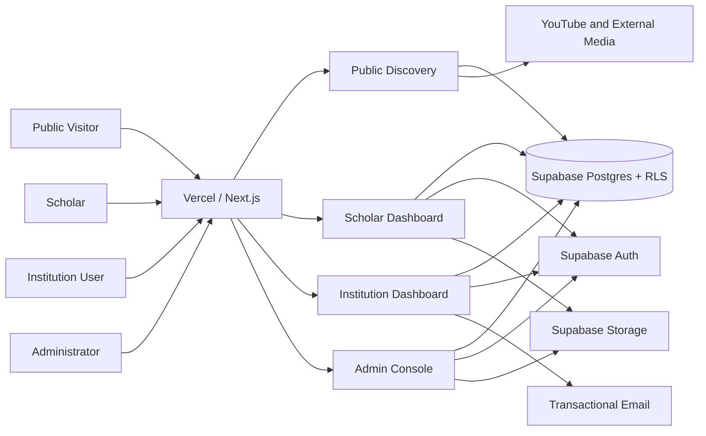

# FaithFull Scholars Full Plan

> **Status:** Approved product, architecture, software-factory, and MVP execution baseline  
> **Consolidated:** June 12, 2026  
> **Primary audience:** Product owners, architects, developers, and AI implementation agents  
> **Required platform:** Next.js on Vercel with a Supabase backend

---

## 1. Executive Summary

FaithFull Scholars is a professional discovery and academic showcase network for professors serving theological colleges, seminaries, Bible colleges, Christian universities, ministry institutes, churches, and related organizations.

The platform embodies the **modern look, feel, and user experience of contemporary LinkedIn**, adapted specifically for the rigor, dignity, and confessional integrity of theological academia (ADR 0007). Profiles emphasize academic credentials, theological and biblical disciplines, institutional affiliations, curriculum vitae, publications, courses, sample teaching content, languages, delivery formats, confessional standards affirmations (ADR 0001), and verified availability for institutional opportunities.

At the core of the platform is an uncompromising **Data Protection, RLS & Anti-Scraping Gating Architecture** (ADR 0008): personal user PII (emails, phone numbers) is strictly isolated from public search surfaces, all 24 database tables enforce 100% Row Level Security, private assets require cryptographically signed URLs, and the public search bar is defended by distributed token-bucket rate limiting, input sanitization, and deep-pagination walls to prevent predatory scraping or candidate harvesting.

The first product is a **Scholar Profile Network** with public course and content discovery. It is not initially a full hiring marketplace.

The platform should answer:

- Who is qualified to teach a particular theological or biblical subject?
- Which scholars are available for adjunct teaching, online instruction, intensives, guest lectures, curriculum review, doctoral supervision, or conference speaking?
- What courses has the scholar taught or prepared?
- Can an institution inspect a syllabus, lecture, free course preview, reading list, or YouTube playlist before contacting the scholar?
- What theological tradition, denomination, languages, credentials, and institutional experience does the scholar publicly identify?
- How can a qualified institution send a respectful, structured inquiry?

## 2. Product Thesis

Discovery of theological faculty is fragmented across institutional websites, CV PDFs, conference programs, denominational networks, personal referrals, YouTube channels, and individual websites.

FaithFull Scholars creates a trusted, searchable academic directory where:

- Scholars maintain one current professional profile.
- Institutions search structured academic and availability data.
- Courses and teaching content are attached to the scholar who offers them.
- Public visitors discover trustworthy theological learning content.
- Admin review protects the credibility of public listings.
- User data is secured by full PostgreSQL RLS, storage encryption, and search abuse gating.

## 3. Platform Baseline

- **Application:** Next.js App Router with TypeScript (Turbopack).
- **Design System:** LinkedIn-Grade Academic Network Design System (ADR 0007) with 3-column desktop layout, persistent universal app bar, and card-based profile architecture.
- **Hosting:** Vercel.
- **Authentication:** Supabase Auth with cookie-based SSR sessions.
- **Database:** Supabase Postgres with 100% Row Level Security (RLS) enforcement.
- **Security & Data Protection:** Multi-tenant isolation (Scholars, Institutions, Admins, Public), PII segregation, token-bucket search rate limiting, deep-pagination walls, and signed storage URLs (ADR 0008).
- **File storage:** Supabase Storage with private encrypted buckets for CVs, full syllabi, and administrative review assets.
- **External media:** YouTube and other external platforms for video, podcasts, and public course content.
- **Styling:** Tailwind CSS with accessible semantic tokens and dignified academic typography.
- **Testing & Quality Gates:** Vitest, PostgreSQL RLS audit (`npm run audit:rls`), ESLint, and Next.js production builds.
- **Deployment:** Vercel preview deployments for pull requests and production deployment from `main`.

## 4. Product Boundaries

The MVP is:

- A scholar profile network.
- A searchable course showcase.
- A structured availability directory.
- A public learning-content discovery portal.
- A lightweight institution-to-scholar inquiry system.
- An admin-reviewed directory.

The MVP is not:

- A learning management system.
- A general social network or feed.
- A payment processor.
- A contract-generation system.
- A complete HR or applicant-tracking system.
- A synchronous chat platform.
- A video-hosting service.
- An automatic credential-verification service.
- A system that infers theological beliefs or denominational identity.

## 5. Users

### Scholars

Professors, adjunct faculty, independent scholars, retired professors, visiting lecturers, doctoral supervisors, curriculum consultants, and ministry educators.

Goals:

- Maintain a credible public academic profile.
- Publish CV highlights and an optional downloadable CV.
- Showcase publications, courses, lectures, and sample content.
- Signal availability.
- Receive qualified institutional inquiries.

### Institutions

Seminaries, Bible colleges, theological colleges, Christian universities, training institutes, churches, denominational offices, and mission organizations.

Goals:

- Search by discipline, course need, credential, language, tradition, region, and availability.
- Review qualifications and teaching samples.
- Save scholars and courses.
- Send structured opportunity inquiries.

### Public Visitors

Students, pastors, church leaders, researchers, and lifelong learners.

Goals:

- Discover scholars.
- Find free lectures, course previews, syllabi, and reading lists.
- Browse theological and biblical topics.

### Administrators

Goals:

- Review scholars and institutions.
- Approve, request changes, reject, or hide profiles.
- Manage verification separately from publication.
- Manage taxonomies and reported content.
- Preserve audit history.

## 6. MVP Features

### Scholar Identity

- Name and preferred title.
- Profile photo.
- Current institution and role.
- Biography.
- Location and time zone.
- Languages.
- Academic and professional links.
- Contact preference.
- Voluntarily disclosed denomination, confession, or tradition.
- Affirmed confessional standards (e.g. Westminster Standards, 1689 London Baptist, Nicene Creed, Lausanne Covenant, Chicago Inerrancy).
- Personal doctrinal statement (text summary or uploaded PDF link).

### Academic Portfolio

- Degrees and awarding institutions.
- Assisted CV ingestion: automated PDF text extraction populating editable draft profile fields to eliminate onboarding friction.
- Structured CV highlights.
- Optional downloadable CV.
- Publications.
- Books, chapters, articles, and conference papers.
- Research interests.
- Supervision areas.
- Grants, fellowships, and awards.

### Course Showcase

- Title and slug.
- Description.
- Discipline and academic level.
- Target audience.
- Delivery modes.
- Availability modes.
- Sample syllabus.
- Reading list.
- Free preview content.
- YouTube video or playlist.
- External course link.
- Availability to teach, adapt, license, or guest lecture.

### Availability

Statuses:

- Open.
- Limited.
- By request.
- Unavailable.

Opportunity types:

- Adjunct course.
- Guest lecture.
- Intensive.
- Online module.
- Course licensing.
- Curriculum review.
- Doctoral supervision.
- Thesis advising.
- Conference speaking.
- Church or ministry training.

Details:

- Earliest term.
- Delivery modes.
- Travel willingness.
- Time zone.
- Languages.
- Institution types served.
- Notes.

### Discovery

Filters:

- Discipline.
- Biblical book.
- Theological topic.
- Course type.
- Availability.
- Delivery format.
- Language.
- Institution.
- Tradition or denomination.
- Confessional standards affirmed.
- Doctrinal statement presence.
- Region.
- Credential level.
- Free content.

Ranking:

1. Exact subject or course match.
2. Confessional / tradition match.
3. Availability match.
4. Language and delivery match.
5. Profile completeness.
6. Free content availability.
7. Recently updated profile.

### Institution Tools

- Institution profile and approval.
- Saved scholars and courses.
- Shortlists.
- Structured inquiry.
- Inquiry history.

Inquiry fields:

- Scholar.
- Optional course.
- Opportunity type.
- Proposed term.
- Delivery mode.
- Contact information.
- Message.

### Admin Tools

- Scholar review queue.
- Revision diff review: side-by-side visual diff of submitted revisions against published snapshots.
- Institution review.
- Approve, request changes, reject, or hide.
- Verification state.
- Review notes and history.
- Taxonomy management (disciplines, traditions, confessional standards).
- Reported-content queue.

## 7. Trust Model

Publication status:

- Draft.
- Submitted.
- Changes requested.
- Approved.
- Hidden.
- Rejected.

Revision Staging Model (ADR 0005):

- Edits to an approved profile do not unpublish the active listing or interrupt public discovery.
- Modifications are saved to a versioned draft revision that is submitted for admin review.
- Admins review changes as structured diffs; approval promotes the revision to the published snapshot.

Verification status:

- Self-reported.
- Institution-affiliated.
- Verified.

Rules:

- Approval allows publication; it does not automatically verify every claim.
- Theological tradition is self-disclosed unless explicitly verified.
- AI-assisted imports remain drafts until the scholar approves them.
- Draft, submitted, rejected, changes-requested, and hidden profiles are never public.

## 8. Information Architecture

```text
/
/scholars
/scholars/:slug
/courses
/courses/:slug
/topics/:slug
/institutions/:slug

/dashboard
/dashboard/profile
/dashboard/cv
/dashboard/publications
/dashboard/courses
/dashboard/availability
/dashboard/inquiries

/institution
/institution/saved
/institution/inquiries

/admin
/admin/reviews
/admin/institutions
/admin/taxonomy
/admin/reports
```

## 9. Architecture



### Vercel

- Hosts Next.js.
- Runs server-rendered pages, route handlers, and server actions.
- Creates preview deployments for pull requests.
- Deploys production from `main`.
- Stores environment-specific configuration.

Controls:

- Preview and production must use the intended Supabase environment.
- Server secrets never use `NEXT_PUBLIC_`.
- Preview workflows are verified before production.

### Supabase

- Authenticates users.
- Stores relational data.
- Enforces RLS.
- Stores CVs, profile images, and course documents.
- Maintains SQL migrations and seed data.

Controls:

- Enable RLS on every exposed table.
- Store roles in app-controlled data, not user-editable metadata.
- Keep the service-role key server-only.
- Store sensitive files private by default.
- Test direct Data API access.

## 10. Domain Model

Core tables:

- `accounts`
- `scholars`
- `scholar_profile_revisions`
- `institutions`
- `institution_users`
- `disciplines`
- `scholar_disciplines`
- `traditions`
- `scholar_traditions`
- `confessional_standards`
- `scholar_confessions`
- `credentials`
- `publications`
- `courses`
- `course_disciplines`
- `media_links`
- `availability_profiles`
- `inquiries`
- `saved_scholars`
- `saved_courses`
- `profile_reviews`
- `reports`

Key scholar fields:

- `account_id`
- `slug`
- `full_name`
- `title`
- `profile_photo_path`
- `current_institution`
- `current_role`
- `biography`
- `location`
- `timezone`
- `contact_preference`
- `doctrinal_statement_text`
- `doctrinal_statement_path`
- `published_revision_id`
- `draft_revision_id`
- `profile_status`
- `verification_status`

Key revision fields:

- `scholar_id`
- `revision_number`
- `status` (draft, submitted, changes_requested, approved, superseded)
- `snapshot_data` (JSONB of versioned fields)
- `admin_notes`
- `submitted_at`
- `reviewed_at`

Key course fields:

- `scholar_id`
- `title`
- `slug`
- `description`
- `level`
- `discipline_id`
- `delivery_modes`
- `availability_modes`
- `syllabus_path`
- `reading_list`
- `public_preview_enabled`
- `visibility`

Key inquiry fields:

- `institution_id`
- `scholar_id`
- `course_id`
- `opportunity_type`
- `proposed_term`
- `delivery_mode`
- `message`
- `contact_email`
- `status`

## 11. Authorization and RLS

### Public

May read:

- Approved public scholars.
- Approved public courses.
- Public media and taxonomy.

May not read:

- Drafts.
- Admin notes.
- Private contact data.
- Private CVs.
- Institution inquiries.

### Scholar

May:

- Manage their own profile, credentials, publications, courses, media, files, and availability.
- Submit their own profile.
- Read inquiries addressed to them.

May not:

- Edit another scholar.
- Approve themselves.
- Change verification status.
- Read private admin notes.

### Institution User

May:

- Manage approved institution records according to role.
- Save scholars and courses.
- Send inquiries.
- Read their institution's inquiries.

May not:

- Access another institution's private data.
- Bypass scholar visibility.
- Use bulk outreach unless separately approved.

### Admin

May:

- Review scholars and institutions.
- Change publication and verification status.
- Manage reports and taxonomy.
- Read files required for review.

Admin actions must be auditable.

## 12. Storage

Buckets:

- `profile-assets`
- `cv-files`
- `course-documents`

Rules:

- Profile images are public only for approved profiles.
- CVs are private by default.
- Scholars manage their own files.
- Admins can read files required for review.
- Public files require explicit publication and an approved parent record.
- Video is not stored in Supabase Storage for the MVP.

## 13. External Media

Supported:

- YouTube.
- Vimeo when needed.
- Personal and institutional websites.
- Podcasts.
- External course pages.

Controls:

- Require `https`.
- Validate provider URLs.
- Normalize metadata.
- Use privacy-conscious embeds.
- Clearly attribute external ownership.

## 14. Abuse and Moderation

- Validate links.
- Rate-limit inquiries and reports.
- Require approved institutions for formal inquiries.
- Preserve review history.
- Soft-delete moderation-sensitive records first.
- Provide report-profile and report-content actions.
- Allow scholars to hide profiles.
- Separate public and private contact fields.

## 15. Software Factory

Required flow:

```text
Idea
  -> product definition
  -> feature design
  -> architecture review
  -> ADR
  -> execution plan
  -> implementation
  -> tests and review
  -> deployment
  -> roadmap and documentation closeout
```

Definition of ready:

- One clear user outcome.
- Explicit non-goals.
- Data changes identified.
- Permission boundaries documented.
- Tests described.
- Dependencies named.
- Exact files and commands listed.

Definition of done:

- Code implemented.
- Tests pass.
- Lint and type checks pass.
- RLS and storage policies verified.
- Visibility rules verified.
- Vercel preview smoke tests pass.
- Documentation updated.
- Limitations recorded.
- Next slice identified.

AI agents must not:

- Infer credentials, tradition, denomination, or availability.
- Publish AI claims without scholar approval.
- Expose service-role keys.
- Use user-editable metadata for authorization.
- Expose draft or hidden records.
- add payments, contracts, chat, LMS, or feed features without approval.

## 16. Target Repository Layout

```text
app/
  (public)/
  dashboard/
  institution/
  admin/
components/
  admin/
  courses/
  forms/
  profiles/
  search/
lib/
  auth/
  courses/
  db/
  inquiries/
  media/
  notifications/
  profiles/
  review/
  search/
  supabase/
  taxonomy/
supabase/
  config.toml
  migrations/
  seed.sql
tests/
  unit/
  integration/
  e2e/
```

## 17. Environment Contract

```bash
NEXT_PUBLIC_SUPABASE_URL=
NEXT_PUBLIC_SUPABASE_PUBLISHABLE_KEY=
SUPABASE_SERVICE_ROLE_KEY=
SUPABASE_PROJECT_ID=
```

Rules:

- Do not commit `.env.local`.
- Do not commit `.vercel/`.
- Service-role credentials are server-only.
- Preview and production should use separate Supabase environments where possible.

## 18. Execution Plan

### Phase 0: Application Foundation

> **Status:** Completed (Next.js 16 App Router, Tailwind CSS, Supabase SSR helpers, Vitest, and CI pipeline)

1. Initialize Next.js App Router with TypeScript, Tailwind, ESLint, and Vercel configuration.
2. Add Vitest/Jest, Testing Library, Playwright, and `npm run verify`.
3. Install `@supabase/supabase-js` and `@supabase/ssr`.
4. Add browser, server, and middleware Supabase clients.
5. Verify cookie-backed sessions using current Supabase SSR guidance.

Acceptance:

- `npm run lint` passes.
- `npm run test` passes.
- `npm run build` passes.

### Phase 1: Supabase Foundation

> **Status:** Completed (22 domain tables, RLS policies on all 24 public tables, ADR 0005 revision model, theological taxonomy and confessional standards seed data, TypeScript domain layer)

1. Run `npx supabase --help`.
2. Run `npx supabase init`.
3. Start local Supabase.
4. Create initial schema migration.
5. Create tables, constraints, indexes, and audit timestamps.
6. Enable RLS on all exposed tables.
7. Add public, scholar, institution, and admin policies.
8. Add storage buckets and policies.
9. Add fictional seed data.
10. Generate TypeScript database types.

Acceptance:

- `npx supabase db reset` succeeds.
- Seed data loads.
- Direct unauthorized access fails.

### Phase 2: Authentication and Roles

1. Implement signup, login, logout, and account recovery.
2. Implement scholar, institution-user, and admin roles.
3. Implement protected routes.
4. Keep roles out of user-editable metadata.

Acceptance:

- Server-rendered authenticated routes work.
- Anonymous access to dashboards fails.
- Role boundaries are tested.

### Phase 3: Public Discovery (Roadmap Phase 2 & Milestone 2.5)

> **Status:** Completed (Public scholar directory, multi-criteria filtering by discipline/tradition/confession/availability, canonical scholar profile displaying credentials and doctrinal statements, course showcase catalog, syllabus inspection, strict draft isolation, unit & integration tests).
> **Milestone 2.5 Enhancement Completed:** Modern LinkedIn-grade design system (ADR 0007), universal persistent top bar with shortcut `/` and quick academic queries, 3-column desktop layout (sticky filters, feed, recommendations rail), cover banners, overlapping avatars, token-bucket search rate limiter (`search_rate_limits`), input sanitization, and 3-page anonymous search cap to prevent candidate scraping (ADR 0008). 100% RLS compliance on all 25 public tables.

1. Build scholar directory and filters.
2. Build scholar profile pages.
3. Build course directory and course pages.
4. Add media previews and public topic pages.
5. Implement LinkedIn-grade navigation shell, profile cards, and 3-column discovery feed.
6. Implement search abuse gating, rate-limiting, and deep pagination access wall.

Acceptance:

- Only approved records are public.
- Draft and hidden records return not found.
- Private contact data is not exposed.
- Search rate limits block scraping attempts with HTTP 429.
- Anonymous discovery is capped at 3 pages before prompting sign-in.
- 100% RLS enforced at PostgreSQL layer.

### Phase 4: Scholar Dashboard (Completed)

> **Status:** Completed (Assisted CV onboarding with heuristic parsing, revision staging manager preserving published profiles, doctrinal statement & confessional standards manager, course/syllabus manager, availability calendar, LinkedIn-grade staging preview, universal translation framework with Spanish `es` catalog).

1. Build profile editor.
2. Build CV and publication manager.
3. Build course and media manager.
4. Build availability manager.
5. Build profile preview and submission.

Acceptance:

- [x] Scholars edit only their own records.
- [x] CV privacy works.
- [x] Unsafe media URLs fail.
- [x] RLS mirrors application authorization.

### Phase 5: Admin Trust Workflows (Completed)

> **Status:** Completed (Admin review queue at `/admin/reviews`, side-by-side visual diff inspector comparing published baseline vs submitted revision, approve/request-changes/reject/hide actions with published snapshot promotion, review audit log in `profile_reviews`, institution verification queue at `/admin/institutions`, reported content moderation queue at `/admin/reports`).

1. Build profile review queue.
2. Add approve, request changes, reject, and hide actions.
3. Preserve review history.
4. Build institution approval.
5. Build reported-content workflow.

Acceptance:

- [x] Review is admin-only.
- [x] Approval controls publication and snapshot promotion.
- [x] Verification remains separate.
- [x] 100% RLS compliance on all 25 tables.

### Phase 6: Institution Workflows (Completed)

> **Status:** Completed (Structured faculty outreach modal on public profiles, candidate shortlists and saved courses in `saved_scholars` / `saved_courses`, scholar inquiry inbox at `/dashboard/inquiries`, institution portal workspace at `/institution`, `/institution/inquiries`, `/institution/saved`, `/institution/profile`, 10 inquiries/hr rate limiting, transactional notification email abstraction, and complete integration test coverage).

1. Build institution profiles and membership.
2. Build saved scholars and courses.
3. Build structured inquiries.
4. Add rate limiting.
5. Add scholar notifications.

Acceptance:

- [x] Only approved institutions send formal inquiries.
- [x] Institutions cannot access each other's records.
- [x] Inquiries are visible only to authorized parties.
- [x] 100% RLS compliance on all 25 tables.

### Phase 7: Vercel Deployment

1. Link the Vercel project.
2. Configure preview and production environment variables.
3. Verify target Supabase project before migrations.
4. Run `vercel build`.
5. Create and test a preview deployment.

Acceptance:

- Preview deployment passes public, scholar, admin, and institution smoke tests.
- Production secrets remain server-only.

### Phase 8: Release Hardening & MVP Deployment Preparation (Completed)

> **Status:** Completed (Strict edge security headers in `next.config.ts`, comprehensive E2E integration test suite across all 4 personas in `tests/integration/e2e-user-journeys.test.ts`, production release readiness checklist in `docs/deployment/release-readiness-checklist.md`, pilot diagnostic inspector in `scripts/verify-pilot-readiness.ts`, and 100% passing automated verification gates with 101 tests and 25/25 RLS tables).

1. [x] Configure strict HTTP security headers: CSP with YouTube/Unsplash/Supabase whitelisting, HSTS, `X-Frame-Options: DENY`, `X-Content-Type-Options: nosniff`, and `Permissions-Policy`.
2. [x] Add comprehensive end-to-end integration tests validating discovery, CV onboarding, revision staging, visual diffs, admin approval, rate limiting, and structured inquiries.
3. [x] Publish the Production Release Readiness Checklist ([`docs/deployment/release-readiness-checklist.md`](deployment/release-readiness-checklist.md)).
4. [x] Create the Pilot Cohort Diagnostic Inspector script (`scripts/verify-pilot-readiness.ts`).
5. [x] Verify 100% RLS across all 25 tables and secret quarantine.
6. [x] Prepare for controlled academic pilot cohort (20–40 scholars, 3–7 theological institutions).

Pilot:

- 20 to 40 scholars.
- 3 to 7 institutions.
- 6 to 10 disciplines.
- At least one course or media item per scholar.
- Focus on adjunct, guest lecture, online course, and curriculum review.

## 19. Verification Commands

```bash
npm run lint
npm run test
npm run build
npm run test:e2e
npm run verify

npx supabase --help
npx supabase start
npx supabase db reset
npx supabase status
npx supabase migration list

vercel pull --yes
vercel build
vercel deploy
```

Agents must verify current official CLI documentation before using commands that may have changed.

## 20. Release Checklist

- [ ] Next.js builds.
- [ ] Vercel environments are configured.
- [ ] Supabase migrations apply.
- [ ] RLS is enabled everywhere required.
- [ ] Public users see approved data only.
- [ ] Scholars modify only their records.
- [ ] Institution data is isolated.
- [ ] Admin review is admin-only.
- [ ] CVs are private by default.
- [ ] Public files require explicit publication.
- [ ] External URLs are validated.
- [ ] Inquiries are authenticated and rate-limited.
- [ ] Service-role credentials are server-only.
- [ ] Unit and integration tests pass.
- [ ] Playwright tests pass.
- [ ] Accessibility checks pass.
- [ ] Vercel preview is approved.
- [ ] Seed data is fictional or permissioned.
- [ ] Published profiles remain visible when new revisions are submitted (ADR 0005).
- [ ] Documentation matches behavior.

## 21. Post-MVP Backlog

- [x] **AI-assisted CV import & syllabus tagging** (`lib/ai/gemini-cv-extractor.ts`, `lib/ai/gemini-syllabus-tagger.ts`).
- [x] **Scholar analytics dashboard** (`/dashboard/analytics`, `lib/analytics/scholar-analytics.ts`).
- [x] **Shortlist export & search dossier** (`/institution/saved/dossier`, `GET /api/institution/saved-scholars/export`).
- [x] **Citation-grounded AI institution search & faculty matcher** (`/api/ai/match-faculty`, `components/search/ai-faculty-matcher-modal.tsx`).
- [ ] Institution subscriptions.
- [ ] Premium scholar profiles.
- [ ] Public SEO topic hubs.
- [ ] Course licensing and syllabus distribution agreements.
- [ ] Contracts and institutional booking workflows.
- [ ] Credential-verification partnerships (ATS/ABHE accreditation registrars).
- [ ] Peer endorsements and theological faculty commendations.
- [ ] Conference speaker directory and institutional speaking bureau.
- [ ] Seminary consortium accounts.

## 22. Governing Decisions

1. Build the Scholar Profile Network first.
2. Add course and content discovery early.
3. Use Vercel for hosting.
4. Use Supabase for Auth, Postgres, RLS, and Storage.
5. Use external video hosting.
6. Require admin review before publication.
7. Decouple live profiles from in-review changes via Draft and Published Profile Revisions (ADR 0005).
8. Keep publication and verification separate.
9. Use structured taxonomy for search, traditions, and confessional standards.
10. Defer payments, contracts, LMS, and social feeds.
11. Require human approval for AI-assisted public claims and CV draft imports.

## 23. AI Handoff

Before implementing:

1. Read this file.
2. Inspect the current repository.
3. Identify the next incomplete phase.
4. Verify current Supabase and Vercel documentation.
5. Work on one branch and one coherent task.
6. Add tests.
7. Run verification.
8. Update implementation status and documentation.

