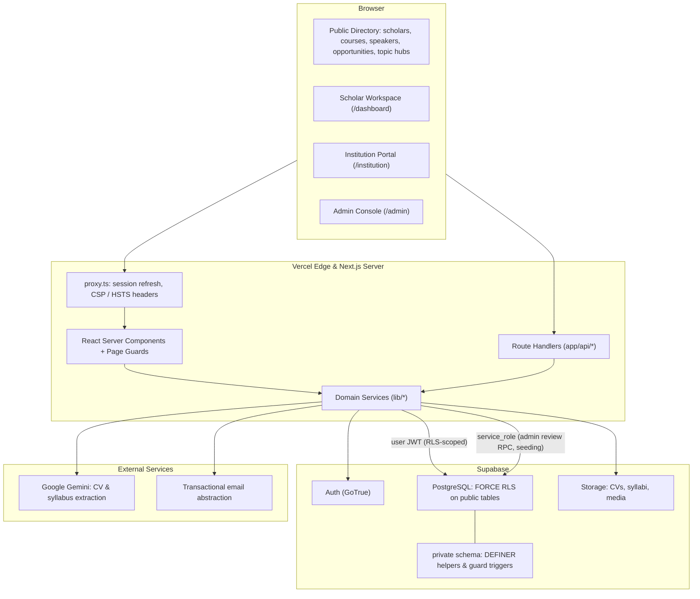
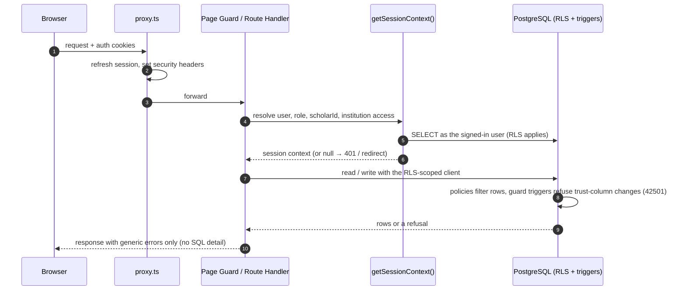
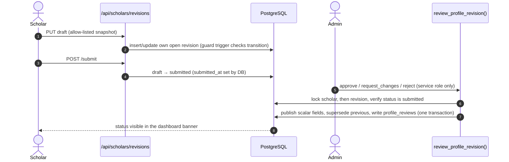
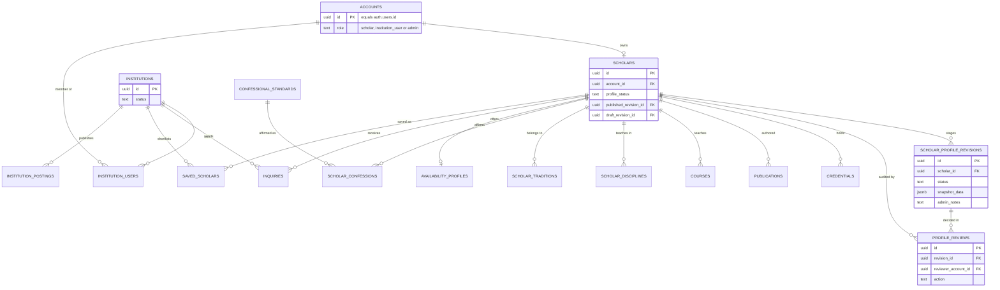
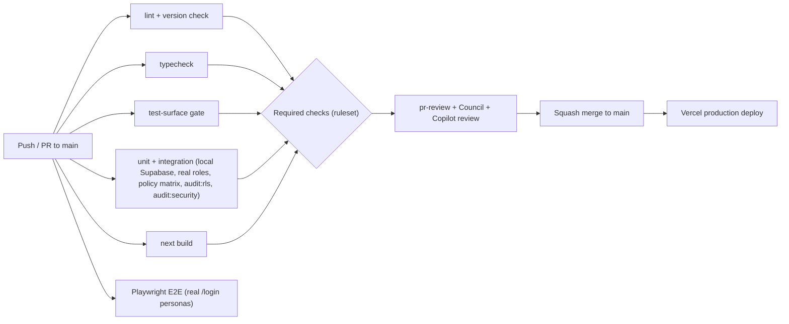

# FaithFull Scholars — System Architecture & Topology

> **Source of truth:** [`FAITHFULL_SCHOLARS_FULL_PLAN.md`](FAITHFULL_SCHOLARS_FULL_PLAN.md)
> **Security baseline:** [ADR 0022](adr/0022-session-derived-identity-and-rls-helper-isolation.md) · [ADR 0023](adr/0023-trust-guards-phase2-and-policy-matrix.md)
> **Version:** `0.1.0` (pre-GA, see [VERSIONING](../VERSIONING.md))

---

## 1. High-Level Topology

FaithFull Scholars is a **Next.js 16 App Router** application on **Vercel**, backed by **Supabase** (PostgreSQL, Auth and Storage). Authorization is enforced in the database with Row Level Security. Application code only shapes what users see.



---

## 2. Request Lifecycle & Trust Boundaries

Every request derives identity from the **session**, never from a client-supplied identifier. Layouts do not protect pages in Next.js 16, so each protected page calls its own guard.



### Security invariants
- **RLS is the boundary.** Every public table has `FORCE ROW LEVEL SECURITY`. Application `WHERE` clauses are never the only protection.
- **Trust columns are guarded.** Roles, publication status, verification status and tiers can be changed only by admins or the service role. The guard triggers fail closed through `private.is_restricted_caller()`.
- **Helpers stay private.** SECURITY DEFINER helpers live in the unexposed `private` schema with `search_path = ''`.
- **The service role is fenced.** An ESLint rule blocks importing the service-role client from user-facing code. Admin decisions go through one service-role-only RPC.
- **Behaviour is tested, not just presence.** Integration suites sign in as real roles. The policy matrix fails on any undeclared column write or on a probe that silently changes nothing.

---

## 3. Profile Revision & Admin Review

Approved profiles stay live while edits are reviewed ([ADR 0005](adr/0005-draft-published-profile-revisions.md)). The persisted lifecycle and the atomic review function are defined in ADR 0024 and land with PR #56.



---

## 4. Core Data Model



Later phases add subscriptions, contracts and milestones, course licensing, consortia, endorsements and speaker topics. Each is covered by RLS and, where it carries trust state, by guard triggers ([ADR 0023](adr/0023-trust-guards-phase2-and-policy-matrix.md)).

---

## 5. CI & Release Pipeline



Production database migrations are applied deliberately: run a preflight query, apply in the hosted SQL editor, verify grants, then deploy the app. See [`deployment/staging-verification-protocol.md`](deployment/staging-verification-protocol.md).

---

## 6. Directory Structure

```text
app/                 Next.js App Router: (admin), (auth), (institution) route groups, dashboard, public pages, api/
components/          UI by domain (scholars, institution, admin, forms, shell, …)
lib/                 Domain services: auth/session, supabase clients, profiles, admin, search, ai, i18n, …
supabase/migrations/ Ordered SQL migrations (RLS, guards, functions); never edit a merged one
scripts/             Audits (RLS, security), seeding, deploy verification, test-surface gate
tests/               unit/, integration/ (live DB, real roles, policy matrix), e2e/ (Playwright), surface/
docs/                Plan, ADRs, product, deployment, testing, factory, reviews
proxy.ts             Session refresh and security headers (Next.js 16 proxy convention)
```
