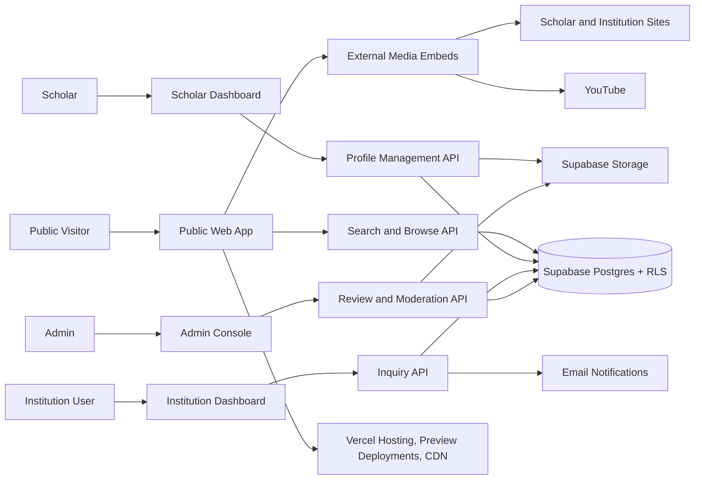

# FaithFull Scholars Architecture Review

## Recommendation

Build FaithFull Scholars as a Vercel-hosted Next.js application with a public discovery surface, authenticated scholar and institution dashboards, admin review tooling, and a Supabase-backed data layer. Supabase should provide Auth, Postgres, Row Level Security, and Storage. Do not start with a transaction marketplace, social feed, or video-hosting platform. Those choices would increase risk before the core discovery loop is proven.

## Architecture Shape

## Platform Architecture

### Vercel

Responsibilities:

- Host the Next.js App Router application.
- Provide preview deployments for pull requests and production deployments from `main`.
- Run server-rendered routes and route handlers through Vercel Functions.
- Serve public pages, optimized images, and cached assets.
- Store environment variables for Supabase project URL, publishable key, and server-only service credentials when absolutely required.

Controls:

- Never expose Supabase service-role credentials through `NEXT_PUBLIC_` variables.
- Use Vercel preview deployments to verify each feature branch before production.
- Treat production Supabase environment variables as separate from preview/development variables.

### Supabase

Responsibilities:

- Authenticate scholars, institution users, and admins.
- Store relational domain data in Postgres.
- Enforce access boundaries with Row Level Security.
- Store CV files, profile photos, and optional scholar-uploaded assets in Supabase Storage.
- Provide SQL migrations and seed data for reproducible environments.

Controls:

- Enable RLS on every table in exposed schemas.
- Use app-controlled role records and policies for scholar, institution, and admin authorization.
- Do not use user-editable metadata for authorization decisions.
- Keep service-role access server-only and limited to administrative workflows that cannot be expressed through user-scoped policies.

## Core Subsystems

### Public Discovery

Responsibilities:

- Render approved scholar profiles.
- Render approved course pages.
- Provide search and filters.
- Expose SEO-friendly topic pages.
- Embed external media safely.

Risks:

- Public profile pages can leak unapproved content if review status is not enforced everywhere.
- Search indexes can become stale if profile approvals and edits are not modeled carefully.

Controls:

- Public queries must filter by `profile_status = approved`.
- Course and media visibility must be checked independently from scholar profile visibility.
- Use canonical slugs with immutable IDs behind them.

### Scholar Dashboard

Responsibilities:

- Profile editing and personal doctrinal statement management.
- Assisted CV ingestion (parsing uploaded PDF into editable draft fields).
- CV and publication management.
- Course management.
- Availability management.
- Theological tradition and confessional standard self-selection.
- Preview and submit revisions for review.

Risks:

- Large free-form profile editors can become hard to moderate.
- CV upload parsing could create false claims if automated without human review.
- Editing an approved profile could accidentally unpublish it or leak unmoderated text.

Controls:

- Store structured fields separately from optional uploaded files.
- Assisted CV parsing creates draft suggestions only, requiring explicit scholar confirmation.
- Decouple live published profile data from working revisions (ADR 0005).
- Keep a profile completion checklist.

### Institution Dashboard

Responsibilities:

- Save scholars and courses.
- Send structured inquiries.
- Track inquiry history.
- Export shortlists.

Risks:

- Institutions may spam scholars.
- Scholars may receive low-quality requests.

Controls:

- Require approved institution accounts for formal inquiry flows.
- Rate-limit inquiries.
- Use structured fields: opportunity type, proposed term, delivery mode, course need, and contact email.

### Admin Console

Responsibilities:

- Review submitted scholar profiles and ongoing revision diffs.
- Approve, request changes, hide, or reject.
- Manage taxonomy (disciplines, traditions, confessional standards).
- Review reported profiles and content.
- Manage institution approval.

Risks:

- Verification decisions can create legal and reputational exposure.
- Taxonomy drift can make search weak.
- High review overhead when approved scholars submit minor edits.

Controls:

- Separate profile publication status from verification status.
- Provide structured diff view comparing published snapshot with submitted revision.
- Store admin notes and review history.
- Keep taxonomy changes admin-only and auditable.

## Data Architecture

Use Supabase Postgres as the source of truth. The domain is relationship-heavy and benefits from constraints, joins, full-text search, RLS, and auditable state transitions.

Primary tables:

- accounts
- scholars
- scholar_profile_revisions
- institutions
- institution_users
- disciplines
- scholar_disciplines
- traditions
- scholar_traditions
- confessional_standards
- scholar_confessions
- credentials
- publications
- courses
- course_disciplines
- media_links
- availability_profiles
- inquiries
- saved_scholars
- saved_courses
- profile_reviews
- reports

## Search Architecture

MVP search can begin with Supabase Postgres filtering and full-text indexes. To ensure performant queries across many-to-many joins (disciplines, traditions, confessional standards), use a pre-aggregated search index view or denormalized text search columns.

Searchable entities:

- scholars
- courses
- public media links
- topic pages

Filter dimensions:

- Academic discipline
- Availability status and opportunity types
- Delivery mode and language
- Theological tradition
- Confessional standards affirmed
- Doctrinal statement presence
- Credential level

Ranking priorities:

1. Exact discipline or course match.
2. Confessional / tradition match.
3. Availability match.
4. Language and delivery-mode match.
5. Profile completeness.
6. Free content availability.
7. Recently updated profiles.

## Media Architecture

The MVP should link and embed external media instead of storing video. Supabase Storage is for CV files, profile photos, and scholar-owned documents, not direct video hosting.

Supported media types:

- YouTube video.
- YouTube playlist.
- Personal website.
- Institution page.
- Podcast episode.
- Downloadable syllabus link.
- Uploaded CV or scholar document stored in Supabase Storage.

Controls:

- Validate provider URLs.
- Store normalized provider metadata.
- Render embeds with privacy-conscious settings where possible.
- Do not claim ownership of externally hosted content.
- Use Supabase Storage policies so private files cannot be read publicly.

## Security Review

### Authentication and Authorization

Required controls:

- Role-based access for scholar, institution user, and admin.
- Ownership checks on all profile, course, CV, media, and availability edits.
- Admin-only review and verification actions.
- Public read access limited to approved and public records.
- Supabase RLS policies that mirror application authorization, so direct Data API access cannot bypass server checks.

### Data Privacy

Sensitive fields:

- Account email.
- Private contact email.
- Admin review notes.
- Institution inquiry details.
- Unpublished CV files or drafts.

Required controls:

- Separate public scholar fields from private account fields.
- Let scholars choose public contact behavior.
- Do not expose admin notes through public APIs.
- Apply soft delete and audit history to moderation-sensitive records.
- Keep Supabase Auth identity data separate from profile claims and platform roles.

### Abuse and Moderation

Abuse vectors:

- Fake scholar profiles.
- Inflated credentials.
- Spam inquiries.
- Harmful or misleading external links.
- Denominational or theological tags used as attack surfaces.

Required controls:

- Admin approval before public listing.
- Report profile/content flow.
- Institution approval before bulk inquiry features.
- Rate limits on inquiry and report submissions.
- Clear terms for self-reported academic and theological claims.

## Integration Review

### YouTube

Use as an external embed and link provider. Do not require YouTube API integration in MVP unless metadata sync becomes necessary. Manual URL submission is enough for first release.

### Email

Needed for account verification, profile-review decisions, and inquiry notifications. Keep email content transactional and auditable.

### CV Files and Assisted Ingestion

Support upload or external link. Uploaded files use Supabase Storage with private-by-default buckets.

In the MVP onboarding flow, an uploaded CV PDF can be processed via an extraction service to parse:
- Contact and current role
- Degrees and institutions
- Publications and citations
- Suggested disciplines and expertise areas

Strict constraints on CV ingestion:
- Parsed text is populated into editable **draft** fields only.
- Scholars must explicitly review, correct, and confirm all fields.
- Automated extraction never directly publishes to the public directory.
- The system preserves a link between the uploaded source CV file and the generated draft records.

### Future AI Capabilities

Post-MVP AI enhancements:

- Suggest disciplines and course tags from syllabus text.
- Create institution shortlist explanations based on query requirements.
- Recommend profile completion improvements.
- Match institution inquiry criteria against scholar doctrinal statements.

AI constraints:

- AI output must remain draft until reviewed.
- AI must cite the source field or file it used.
- AI must not infer theological tradition, credentials, or availability.

## Architecture Risks

| Risk | Severity | Mitigation |
| --- | --- | --- |
| Trust claims become legally or reputationally risky | High | Separate self-reported, affiliated, and verified status |
| Published profile disappears when scholar edits bio/data | High | Use Revision Staging Model (ADR 0005) so live profile stays public during review |
| MVP scope expands into LMS or hiring marketplace | High | Keep courses as showcase records and inquiries as lightweight outreach |
| Search quality is poor because profile data is too free-form | Medium | Use controlled taxonomy for disciplines, traditions, confessional standards, and availability |
| Scholars do not complete onboarding due to high friction | High | Provide assisted CV ingestion to pre-fill draft profile fields |
| Scholars do not maintain availability | Medium | Make availability coarse, easy to update, and visible in completion checklist |
| Institutions spam scholars | Medium | Require approved institution accounts and rate-limit inquiries |
| External media links rot | Low | Add link status checks in later operations workflow |
| RLS policies diverge from app authorization | High | Test direct Supabase access patterns and keep policies in migrations |
| Vercel preview and production use wrong Supabase environment | Medium | Use separate env vars and document deployment setup |

## Initial ADRs

- ADR 0001: Start as Scholar Profile Network, not full marketplace.
- ADR 0002: Use external media hosting for MVP.
- ADR 0003: Use admin-reviewed publication status before public profiles.
- ADR 0004: Use Vercel and Supabase as the platform baseline.
- ADR 0005: Decouple live profiles from in-review changes via Draft and Published Profile Revisions.
