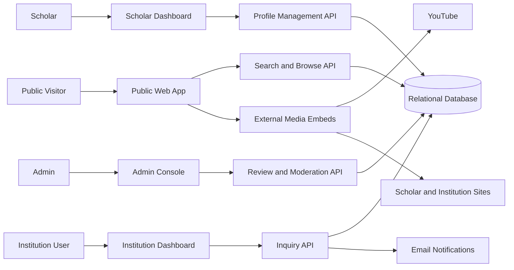

# FaithFull Scholars Architecture Review

## Recommendation

Build FaithFull Scholars as a modular web application with a public discovery surface, authenticated scholar and institution dashboards, admin review tooling, and a structured relational data model. Do not start with a transaction marketplace, social feed, or video-hosting platform. Those choices would increase risk before the core discovery loop is proven.

## Architecture Shape

## Core Subsystems

### Public Discovery

Responsibilities:

- Render approved scholar profiles.
- Render approved course pages.
- Provide search and filters.
- Expose SEO-friendly topic pages.
- Embed external media safely.

Risks:

- Public profile pages can leak unapproved content if review status is not enforced everywhere.
- Search indexes can become stale if profile approvals and edits are not modeled carefully.

Controls:

- Public queries must filter by `profile_status = approved`.
- Course and media visibility must be checked independently from scholar profile visibility.
- Use canonical slugs with immutable IDs behind them.

### Scholar Dashboard

Responsibilities:

- Profile editing.
- CV and publication management.
- Course management.
- Availability management.
- Preview and submit for review.

Risks:

- Large free-form profile editors can become hard to moderate.
- CV upload parsing could create false claims if automated too early.

Controls:

- Store structured fields separately from optional uploaded files.
- Treat any AI-assisted import as draft text requiring scholar review.
- Keep a profile completion checklist.

### Institution Dashboard

Responsibilities:

- Save scholars and courses.
- Send structured inquiries.
- Track inquiry history.
- Export shortlists.

Risks:

- Institutions may spam scholars.
- Scholars may receive low-quality requests.

Controls:

- Require approved institution accounts for formal inquiry flows.
- Rate-limit inquiries.
- Use structured fields: opportunity type, proposed term, delivery mode, course need, and contact email.

### Admin Console

Responsibilities:

- Review submitted scholar profiles.
- Approve, request changes, hide, or reject.
- Manage taxonomy.
- Review reported profiles and content.
- Manage institution approval.

Risks:

- Verification decisions can create legal and reputational exposure.
- Taxonomy drift can make search weak.

Controls:

- Separate profile publication status from verification status.
- Store admin notes and review history.
- Keep taxonomy changes admin-only and auditable.

## Data Architecture

Use a relational database as the source of truth. The domain is relationship-heavy and benefits from constraints, joins, and auditable state transitions.

Primary tables:

- accounts
- scholars
- institutions
- institution_users
- disciplines
- scholar_disciplines
- traditions
- scholar_traditions
- credentials
- publications
- courses
- course_disciplines
- media_links
- availability_profiles
- inquiries
- saved_scholars
- saved_courses
- profile_reviews
- reports

## Search Architecture

MVP search can begin with database-backed filtering and full-text indexes. A dedicated search engine can be introduced later if ranking, typo tolerance, faceting, and scale require it.

Searchable entities:

- scholars
- courses
- public media links
- topic pages

Ranking priorities:

1. Exact discipline or course match.
2. Availability match.
3. Language and delivery-mode match.
4. Profile completeness.
5. Free content availability.
6. Recently updated profiles.

## Media Architecture

The MVP should link and embed external media instead of storing video.

Supported media types:

- YouTube video.
- YouTube playlist.
- Personal website.
- Institution page.
- Podcast episode.
- Downloadable syllabus link.

Controls:

- Validate provider URLs.
- Store normalized provider metadata.
- Render embeds with privacy-conscious settings where possible.
- Do not claim ownership of externally hosted content.

## Security Review

### Authentication and Authorization

Required controls:

- Role-based access for scholar, institution user, and admin.
- Ownership checks on all profile, course, CV, media, and availability edits.
- Admin-only review and verification actions.
- Public read access limited to approved and public records.

### Data Privacy

Sensitive fields:

- Account email.
- Private contact email.
- Admin review notes.
- Institution inquiry details.
- Unpublished CV files or drafts.

Required controls:

- Separate public scholar fields from private account fields.
- Let scholars choose public contact behavior.
- Do not expose admin notes through public APIs.
- Apply soft delete and audit history to moderation-sensitive records.

### Abuse and Moderation

Abuse vectors:

- Fake scholar profiles.
- Inflated credentials.
- Spam inquiries.
- Harmful or misleading external links.
- Denominational or theological tags used as attack surfaces.

Required controls:

- Admin approval before public listing.
- Report profile/content flow.
- Institution approval before bulk inquiry features.
- Rate limits on inquiry and report submissions.
- Clear terms for self-reported academic and theological claims.

## Integration Review

### YouTube

Use as an external embed and link provider. Do not require YouTube API integration in MVP unless metadata sync becomes necessary. Manual URL submission is enough for first release.

### Email

Needed for account verification, profile-review decisions, and inquiry notifications. Keep email content transactional and auditable.

### CV Files

Support upload or external link. If upload is implemented, store files in private object storage with explicit public access controls for CVs the scholar chooses to publish.

### Future AI

Potential AI features:

- Parse uploaded CV into draft profile fields.
- Suggest disciplines and course tags from syllabus text.
- Create institution shortlist explanations.
- Recommend profile completion improvements.

AI constraints:

- AI output must remain draft until reviewed.
- AI must cite the source field or file it used.
- AI must not infer theological tradition, credentials, or availability.

## Architecture Risks

| Risk | Severity | Mitigation |
| --- | --- | --- |
| Trust claims become legally or reputationally risky | High | Separate self-reported, affiliated, and verified status |
| MVP scope expands into LMS or hiring marketplace | High | Keep courses as showcase records and inquiries as lightweight outreach |
| Search quality is poor because profile data is too free-form | Medium | Use controlled taxonomy for disciplines, opportunity types, languages, and delivery modes |
| Scholars do not maintain availability | Medium | Make availability coarse, easy to update, and visible in completion checklist |
| Institutions spam scholars | Medium | Require approved institution accounts and rate-limit inquiries |
| External media links rot | Low | Add link status checks in later operations workflow |

## Initial ADRs

- ADR 0001: Start as Scholar Profile Network, not full marketplace.
- ADR 0002: Use external media hosting for MVP.
- ADR 0003: Use admin-reviewed publication status before public profiles.
- ADR 0004: Use structured taxonomy for discovery fields.
