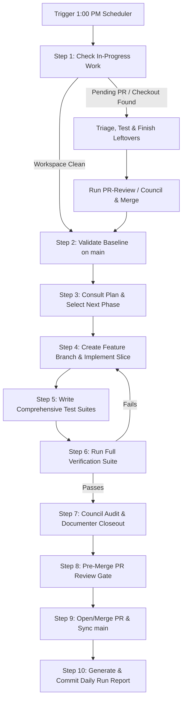

# Daily 1:00 PM Autonomous Scheduler Operating Protocol

> **Target Schedule:** Every day at 1:00 PM local time (`0 13 * * *`)  
> **Source of Truth:** [`AGENTS.md`](file:///Users/rjulia/programs/FaithFullScholars/AGENTS.md), [`improve-software.md`](file:///Users/rjulia/programs/FaithFullScholars/improve-software.md), and [`docs/FAITHFULL_SCHOLARS_FULL_PLAN.md`](file:///Users/rjulia/programs/FaithFullScholars/docs/FAITHFULL_SCHOLARS_FULL_PLAN.md)  
> **Location:** `docs/factory/daily-scheduler-protocol.md`

---

## 1. Objective

This protocol governs the automated, daily 1:00 PM development cycle for FaithFull Scholars. Each run follows an ironclad sequence:
1. **Triage & Closeout:** Identify any unfinished tasks, open PRs, or unmerged feature branches from the previous run, validate them, complete them, and close them out cleanly.
2. **Roadmap Traversal:** If the workspace is clean (or once cleaned), consult the master plan ([`docs/FAITHFULL_SCHOLARS_FULL_PLAN.md`](file:///Users/rjulia/programs/FaithFullScholars/docs/FAITHFULL_SCHOLARS_FULL_PLAN.md)) to identify the next sequential phase/milestone.
3. **Execution & Test Engineering:** Implement the next slice on a dedicated feature branch, writing comprehensive test suites and enforcing PostgreSQL Row Level Security (RLS) and multi-tenant isolation.
4. **Software Factory Protocol:** Execute the mandatory Council review (4 read-only audit agents + synthesis), Documenter closeout, and pre-merge `pr-review` gate.
5. **Report Generation:** Publish a committed, timestamped run report in `docs/reviews/run-reports/`.

---

## 2. Operating Sequence (Step-by-Step)



### Step 1: Workspace & Previous Run Triage

1. **Inspect Git State:**
   - Run `git status`, `git branch -a`, and `git stash list`.
   - Run `gh pr list` (if GitHub CLI is available) to check for open PRs.
   - Inspect the latest run report in `docs/reviews/run-reports/` and the latest entry in [`CHANGELOG.md`](file:///Users/rjulia/programs/FaithFullScholars/CHANGELOG.md).
2. **Handle Incomplete / Leftover Work:**
   - If an unmerged feature branch or open PR exists:
     - Checkout the branch (`git checkout <branch-name>`).
     - Inspect uncommitted changes or unstaged diffs.
     - Run verification: `npm run verify` (`npm run lint`, `npm run test`, `npm run audit:rls`, `npm run build`).
     - Finish any incomplete items from the task plan.
     - Complete test coverage for the branch.
     - Run the mandatory `pr-review` gate (`.claude/skills/pr-review`).
     - If non-trivial, verify that Council audit and Documenter sign-off exist.
     - Open/merge the PR into `main`, checkout `main`, pull latest, and delete the feature branch.
3. **If Dirty Working Tree on `main`:**
   - Determine if the uncommitted files represent abandoned work or in-progress edits.
   - If valid in-progress work, create a feature branch (`git checkout -b feat/...`), commit, verify, review, and close out.
   - If transient or unwanted, clean up safely with user awareness.

---

### Step 2: Validate Baseline on `main`

Once `main` is active and updated:
1. Run `git pull origin main`.
2. Execute the verification suite:
   ```bash
   npm run lint
   npm run test
   npm run audit:rls
   npm run build
   ```
3. If baseline verification fails, STOP development of new phases immediately. Triage and fix the regression on `main` before introducing new features.

---

### Step 3: Roadmap Traversal & Phase Selection

1. Open [`docs/FAITHFULL_SCHOLARS_FULL_PLAN.md`](file:///Users/rjulia/programs/FaithFullScholars/docs/FAITHFULL_SCHOLARS_FULL_PLAN.md) §18 ("Execution Plan") and [`docs/product/roadmap.md`](file:///Users/rjulia/programs/FaithFullScholars/docs/product/roadmap.md).
2. Cross-reference with:
   - Recent migrations in `supabase/migrations/`
   - Active routes in `app/` and utilities in `lib/`
   - Unreleased notes in [`CHANGELOG.md`](file:///Users/rjulia/programs/FaithFullScholars/CHANGELOG.md)
3. Select the earliest uncompleted milestone or sub-milestone:
   - **Phase 0:** Application Foundation *(Completed)*
   - **Phase 1:** Supabase Domain Foundation (Disciplines, Traditions, Confessional Standards, Profile Revisions, RLS, Seed Data)
   - **Phase 2:** Authentication and Roles (Scholar, Institution, Admin RBAC, Protected Layouts)
   - **Phase 3:** Public Discovery (Directory, Filters, Profile Detail, Course Showcase, Topic Pages)
   - **Phase 4:** Scholar Dashboard (CV Onboarding, Profile Revisions Staging ADR-0005, Media, Availability)
   - **Phase 5:** Admin Trust Workflows (Review Queue, Diff Viewer, Approval Actions, Audit Trail)
   - **Phase 6:** Institution Workflows (Saved Lists, Formal Inquiries, Rate Limiting)
   - **Phase 7:** Vercel Deployment & Secret Hardening
   - **Phase 8:** Release Hardening & Controlled Pilot
4. Scope today's work to a coherent, deliverable slice (never an open-ended mega-task).

---

### Step 4: Branching & Implementation Discipline

1. **Create Feature Branch:**
   ```bash
   git checkout -b feat/<phase-num>-<short-description>
   ```
   *Rule: Never commit or push directly to `main`.*
2. **Architecture & ADRs:**
   - If introducing new boundaries, role permissions, schema tables, or external contracts, draft an ADR in `docs/adr/XXXX-<name>.md`.
3. **Implementation Standards:**
   - Follow Next.js App Router rules (verify in `node_modules/next/dist/docs/` if needed).
   - No side-effects inside render paths.
   - Strict multi-tenant isolation: Scholars own their draft revisions; Institutions own private inquiries; Public only sees approved snapshots.
   - Enforce authorization in PostgreSQL RLS policies (`supabase/migrations/`), never solely in client or application handlers.
   - Validate external inputs at system boundaries; never trust client-supplied IDs.

---

### Step 5: Test Suite Engineering

Every new feature or modified behavior must be accompanied by tests:
1. **Unit & Component Tests:** Vitest tests under `tests/unit/` for pure logic, transforms, and UI states.
2. **Integration & API Tests:** Tests under `tests/integration/` verifying Route Handlers, Server Actions, auth checks, and error boundaries.
3. **Security & RLS Tests:** Validate that unauthorized access fails, draft records are isolated, and role checks hold true. Run:
   ```bash
   npm run audit:rls
   ```
4. **Execution & Gate:**
   ```bash
   npm run test
   npm run lint
   npm run build
   ```
   *Rule: A failing test, lint error, or RLS leak is a hard stop condition. It must be resolved before proceeding.*

---

### Step 6: Software Factory Governance (Council & PR Review)

Follow [`improve-software.md`](file:///Users/rjulia/programs/FaithFullScholars/improve-software.md):
1. **The Council (for non-trivial changes):**
   - Audit across 4 dimensions:
     - Agent 1: Data & API Audit (RLS, schema, server actions, isolation)
     - Agent 2: Route & Page Audit (destinations, stubs, link consistency)
     - Agent 3: UX & Shell Audit (accessibility, loading/empty states, error boundaries)
     - Agent 4: Feature Completeness & Competitive Gap
   - Synthesize consensus and commit audit output to `docs/reviews/`.
2. **Documenter Close-Out:**
   - Update [`docs/FAITHFULL_SCHOLARS_FULL_PLAN.md`](file:///Users/rjulia/programs/FaithFullScholars/docs/FAITHFULL_SCHOLARS_FULL_PLAN.md) and [`docs/product/roadmap.md`](file:///Users/rjulia/programs/FaithFullScholars/docs/product/roadmap.md) to reflect exact reality.
   - Add `[Unreleased]` entry in [`CHANGELOG.md`](file:///Users/rjulia/programs/FaithFullScholars/CHANGELOG.md).
   - Update [`README.md`](file:///Users/rjulia/programs/FaithFullScholars/README.md) if installation, config, or user-facing behavior changed.
3. **Pre-Merge PR Review Gate:**
   - Run `pr-reviewer` against the branch diff.
   - Rank findings (Critical / Important / Minor).
   - Resolve all Critical and Important findings.

---

### Step 7: Branch / PR Closeout

1. Commit all code, tests, docs, and review artifacts with a semantic commit message:
   ```bash
   git commit -m "feat(<phase>): <deliverable description>"
   ```
2. Open a pull request (or prepare branch for merge), referencing Council and PR review sign-offs.
3. Merge branch to `main` following repository policies.
4. Checkout `main`, pull latest, and prune merged branch.

---

### Step 8: Generate Daily Run Report

Commit a comprehensive markdown report to `docs/reviews/run-reports/YYYY-MM-DD-daily-run.md` containing:
- **Run Metadata:** Date, timestamp, executor, starting git SHA, ending git SHA.
- **Section 1: Previous Work Triage:** What leftover work, branch, or PR was found; actions taken to finish/merge or clean up.
- **Section 2: Phase & Objective:** Phase selected from `docs/FAITHFULL_SCHOLARS_FULL_PLAN.md`, problem statement, user stories addressed.
- **Section 3: Architecture & Security:** Schema changes, RLS policies, ADRs added, threat analysis.
- **Section 4: Code & Test Changes:** List of files created/modified, new test suites added, coverage details.
- **Section 5: Verification Results:** Output summaries of `npm run lint`, `npm run test`, `npm run audit:rls`, `npm run build`.
- **Section 6: Governance Sign-off:** Council audit findings, Documenter updates, PR Reviewer findings and resolutions.
- **Section 7: Residual Risk & Tomorrow's 1:00 PM Starting Point:** Known limitations, dependencies, and the exact next slice recommended.

---

## 3. Verbatim Prompt for Scheduler

When registering the schedule (via `/schedule` or the Antigravity `schedule` tool), use the following prompt text:

```text
Run the FaithFull Scholars daily 1:00 PM development cycle per docs/factory/daily-scheduler-protocol.md:

1. TRIAGE LEFTOVERS: Check git status, open PRs, active branches, and unstaged changes. If any unfinished work or open PR exists from the prior run, checkout that branch, validate it, complete any missing tests/logic, run the Council and PR-review gates, merge to main, and sync main.
2. BASELINE VALIDATION: Verify main passes: npm run lint, npm run test, npm run audit:rls, npm run build. Stop and fix any regression before moving forward.
3. ROADMAP TRAVERSAL: Read docs/FAITHFULL_SCHOLARS_FULL_PLAN.md §18 and docs/product/roadmap.md. Identify the next uncompleted phase or slice.
4. EXECUTION: Create a new feature branch (git checkout -b feat/...). Implement the scoped slice following Next.js App Router rules, Supabase multi-tenant isolation, and RLS policies. Draft an ADR under docs/adr/ if new boundaries or schema patterns are added.
5. TESTING: Write comprehensive unit, integration, and RLS test suites. Ensure npm run test, npm run lint, npm run audit:rls, and npm run build all pass green.
6. GOVERNANCE: Execute the Council review (4-agent audit + synthesis) and Documenter closeout (update FAITHFULL_SCHOLARS_FULL_PLAN.md, CHANGELOG.md, README.md). Run the mandatory pr-review gate and resolve all Critical/Important findings.
7. CLOSEOUT & REPORT: Open/merge the PR into main, sync main, and write a full run report at docs/reviews/run-reports/YYYY-MM-DD-daily-run.md detailing leftovers triaged, phase delivered, test results, and next recommended slice.
```
