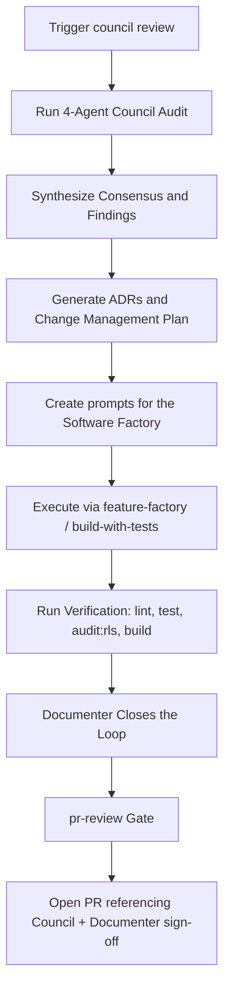

# IMPROVE-SOFTWARE — Council Review & Software Factory Protocol

This protocol defines the repeatable cycle of auditing code (the 4-agent audit Council), planning changes (ADRs and change management), executing features/fixes (the software factory), reviewing before merge (`pr-review`), and closing the loop (the Documenter).

## 0. Mandate

**The Council runs before every merge to the default branch.** This is not optional for meaningful work. Any PR of non-trivial size (new feature, schema change, security-relevant change, or an accumulated multi-commit branch) must have a Council pass and Documenter sign-off referenced in the PR description before merge. Small, isolated fixes (typo, single-line config, a dependency bump with no behavior change) may skip the Council — but the exception is the branch being small, not the reviewer being in a hurry.

**The `pr-review` gate applies to every PR regardless of size** — it is separate from, and does not replace, the Council mandate above.

The Council is five agents, not four:
- **Agents 1–4:** read-only audit — data/API, routes/pages, UX/shell, feature/competitive.
- **Agent 5 — Documenter:** write role. Runs after synthesis and after factory execution verifies cleanly. Updates the planning doc, `CHANGELOG.md`, README/docs, finalizes ADRs, commits the Council's own output, and writes memory/handoff notes.

Do not let audits run and stop at "findings noted" with no Documenter step — that is how planning docs and changelogs silently drift out of sync with what actually shipped.

---

## 1. The Improvement Command Cycle



1. **Audit (Council):** spawn 4 read-only agents in parallel with the prompts below, using `/Users/rjulia/programs/FaithFullScholars` as the repo root and FaithFull Scholars specifics (scholars, institutions, admins, courses, availability, confessional standards, and inquiry workflows).
2. **Synthesize:** group findings into cross-agent consensus, list architectural decisions, outline sequence of work.
3. **ADRs:** draft an ADR under `docs/adr/` for any new boundary, role-access pattern, integration contract, or data-exposure rule the Council identifies.
4. **Change Management:** turn agreed findings into concrete, sequenced implementation prompts.
5. **Software Factory Execution:** hand prompts to `feature-factory` / `build-with-tests`.
6. **Verification:** once lint, test, RLS audit (`npm run audit:rls`), and build are clean, proceed — not before. A red result routes back to the builder, not forward to Documenter.
7. **Documentation Close-Out (Documenter):** update plan, changelog, docs, ADRs, memory.
8. **`pr-review` gate:** run `pr-reviewer` against the finished diff; resolve Critical/Important findings.
9. **PR:** only after Documenter and `pr-review` sign-off does the branch open a PR, referencing the Council synthesis and confirming both sign-offs in the description.

---

## 2. Phase 1: Spawning the Council (Audit Prompts)

### Agent 1 — Data & API Audit

```
You are Council Agent 1 for FaithFull Scholars. Your job is a data and API state audit. READ-ONLY — do not edit any files.

Repo root: /Users/rjulia/programs/FaithFullScholars

Produce a structured report covering:

1. Schema/migrations — inventory all table/model definitions in `supabase/migrations/` and `lib/db/`. List each table, whether PostgreSQL Row Level Security (RLS) is enforced, and flag any tables with missing policies or no corresponding application references.
2. Lib & Server Utilities — list major directories in `lib/` (`lib/supabase/`, `lib/profiles/`, `lib/courses/`, `lib/inquiries/`, `lib/review/`). Note key types and verify matching tests exist near the source. Flag gaps.
3. API Routes & Server Actions — list every Route Handler (`app/api/**/route.ts`) and Server Action with its auth and role requirement (scholar, institution_user, admin, public).
4. App Pages/Views — list every page/route under `app/`. Flag any that are redirect-only or empty stubs.
5. Seed/fixture data — check `supabase/seed.sql`. Are theological disciplines, traditions, confessional standards, sample scholars, courses, and inquiries realistic? What's missing (edge cases, pending revisions, exception notes)?
6. Top 5 critical gaps for data/API security and completeness — specifically verify RLS policies, multi-tenant isolation, and draft vs. published profile separation (ADR 0005).

Return concise structured markdown, 500–700 words. Name every gap specifically.
```

### Agent 2 — Route & Page Audit

```
You are Council Agent 2 for FaithFull Scholars. Your job is a route and page audit. READ-ONLY.

Repo root: /Users/rjulia/programs/FaithFullScholars

1. Shell/nav inventory — inspect `app/layout.tsx`, navigation bars, and headers. List every navigation destination across public, scholar dashboard, institution, and admin shells.
2. Page existence check — for every destination (`/`, `/scholars`, `/scholars/[slug]`, `/courses`, `/dashboard/profile`, `/dashboard/onboarding`, `/dashboard/courses`, `/dashboard/availability`, `/admin/reviews`, `/dev/status`), verify a real page exists. Mark EXISTS / STUB / MISSING.
3. API & Server Action completeness — for every client form or interactive action (profile save, CV upload, inquiry submit, review decision), verify the corresponding Server Action or endpoint exists. Report orphaned handlers.
4. Link consistency — flag any hardcoded links pointing at routes with no implementation.
5. Summary table: | Route | Shell | Page Status | Notes |

Return concise structured markdown, 400–600 words. Name every stub and missing route.
```

### Agent 3 — UX & Shell Audit

```
You are Council Agent 3 for FaithFull Scholars. Your job is a UX and shell quality audit. READ-ONLY.

Repo root: /Users/rjulia/programs/FaithFullScholars

1. Accessibility correctness — scan shell/nav/interactive components for correct ARIA usage (aria-expanded, aria-selected, aria-label, aria-current). Flag strings where booleans are needed, or missing labels on form inputs.
2. Loading and empty states — do major views (scholar directory, profile details, course listings, review queue) handle empty search results, pending profile states, and slow loads gracefully?
3. Styling completeness — verify Tailwind CSS classes and design consistency. Is typography legible for dense academic CVs and publication citations? Is it responsive?
4. Nav active-state consistency across every shell/layout.
5. Error handling — check presence of `error.tsx`, `not-found.tsx`, and `global-error.tsx`. Do Server Actions and data loaders degrade gracefully without leaking database error details?
6. Top 3 UX pain points a scholar or academic dean would hit today.

Return concise structured markdown, 400–600 words. Be specific, with file/line references.
```

### Agent 4 — Feature & Competitive Audit

```
You are Council Agent 4 for FaithFull Scholars. Your job is feature completeness and competitive gap analysis. READ-ONLY.

Repo root: /Users/rjulia/programs/FaithFullScholars

Read first: `docs/FAITHFULL_SCHOLARS_FULL_PLAN.md`, `docs/product/master-plan.md`, `docs/architecture/architecture-review.md`, and relevant ADRs.

1. Workflow completion — % complete for each core MVP module:
   - Public Scholar Directory & Filters
   - Public Scholar Profile (with Doctrinal Statement & Confessional Standards)
   - Course Showcase (Syllabi & Media Embeds)
   - Assisted CV Onboarding & Draft Ingestion (Phase 3)
   - Scholar Profile Dashboard & Revision Staging (ADR 0005)
   - Institution Inquiry System
   - Admin Review & Diff Inspection (ADR 0003, ADR 0005)
2. User role coverage — rate role-based access validation for Scholar, Institution User, Admin, and Public Visitor.
3. Core operations workflows — rate completeness of high-risk workflows: draft isolation, credential publication, and institution inquiry vetting.
4. Domain gap — compare against theological academic recruitment realities (ATS/ABHE accreditation requirements, confessional alignment, syllabus IP rights).
5. Readiness score, 0–100, with justification. Be honest, not encouraging.

Return concise structured markdown, 500–700 words.
```

---

## 3. Phase 2: Synthesis & Change Management

After all agent reports:

1. **Cross-Agent Consensus** — findings multiple agents independently flagged; highest priority. Explicitly verify (not assume) any factual claim before it goes into the synthesis — re-run the relevant command/check yourself if it's cheap to do so, and correct the record if an agent's claim doesn't hold up.
2. **ADR Drafts** — for every new boundary, role-access pattern, integration contract, or data-exposure rule, under `docs/adr/`, sequentially numbered.
3. **Implementation Prompts**, one per agreed change:
   ```
   ## Prompt [LETTER] — [SHORT TITLE]
   **ADR Reference:** ADR-XXXX (if applicable)
   **Files:** [files to create/modify]
   **Scope:** [1–3 sentences]
   **Work:** [numbered steps]
   **Verification:** [lint / test / audit:rls / build]
   ```
4. **Execution Order** — dependency-ordered; note what's parallelizable.
5. **Scope note** — if the Council was run as a full audit against a small/scoped branch rather than a diff-scoped review of that branch, say so explicitly, so a future reader doesn't mistake "no findings against the branch" for "the branch was reviewed."

---

## 4. Phase 3: Software Factory Processing

Every prompt from synthesis goes through `feature-factory` / `build-with-tests`.

### Code Quality & Implementation Standards
- No impure operations (`Date.now()`, `Math.random()`, network/DB calls) inside render/computed paths — isolate side effects per the framework's idiomatic pattern.
- Multi-tenant data isolation: Scholars, institutions, and public visitors stay strictly isolated; verify using RLS policies.
- All database changes enforce row-level access checks; run `npm run audit:rls` to verify against live PostgreSQL state.
- Retain existing comments, type boundaries, and docstrings unrelated to the current change.
- Never commit directly to `main`.

### Sanity Checks Before Delivery
1. Full test suite: `npm run test`
2. RLS data-isolation audit: `npm run audit:rls`
3. Lint: `npm run lint`
4. Build: `npm run build`

Only once all four are clean does work move to Phase 4. A red result is a stop condition, not a Documenter task.

---

## 5. Phase 4: Documentation Close-Out (Documenter)

Runs once Phase 3 is clean and before a PR opens.

**Task:** make finished, verified work legible to anyone reading the repo without this conversation.

**Work:**
1. Update the planning/roadmap doc (`docs/FAITHFULL_SCHOLARS_FULL_PLAN.md`, `docs/product/roadmap.md`) — correct status/roadmap sections to match reality; don't leave it describing work that already shipped or hasn't started.
2. Add a `CHANGELOG.md` `[Unreleased]` entry in the repo's existing style.
3. Update `README.md` and affected `docs/` pages for meaningful changes.
4. Finalize any ADR referenced by the synthesis.
5. Confirm the Council's own `docs/reviews/` output is committed, not just produced in chat.
6. Update persistent memory with anything future sessions need — new mandates, decisions, recurring gotchas. Skip anything derivable from code or git history.
7. Write one committed handoff note (PR description or `docs/reviews/` entry): intent, architecture impact, verification commands/results, residual risk, follow-up work.

**Stop condition:** if status can't be verified (no passing test, no green build), report that instead of marking it done.

---

## 6. Phase 5: PR Review Gate

Before any PR opens, run `pr-review` (`pr-reviewer` subagent) against the full diff. It ranks findings Critical → Important → Minor and cannot merge/approve/close anything. Critical or Important findings block the PR until resolved; Minor findings are the author's call.

---

## Output Location

Commit, every Council round:
- `docs/reviews/YYYY-MM-DD-council-review-[N]-synthesis.md`
- `docs/reviews/YYYY-MM-DD-council-review-[N]-agent-[1-4]-*.md`
- `docs/adr/XXXX-*.md` for any new ADRs
- Documenter's updates to planning docs, `CHANGELOG.md`, `README.md`, `docs/`, and memory

A Council round is complete when this list is true on disk, not when the last agent report is written.
